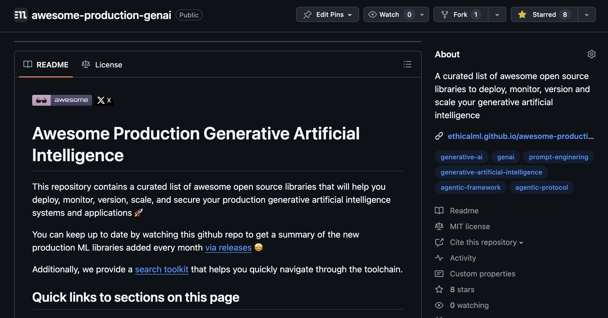

# Awesome Production Machine Learning

This repository contains a curated list of awesome open source libraries that will help you deploy, monitor, version, scale, and secure your production machine learning 🚀

You can keep up to date by watching this github repo to get a summary of the new production ML libraries added every month [via releases](https://github.com/EthicalML/awesome-production-machine-learning/releases) 🤩

Additionally, we provide a [search toolkit](https://huggingface.co/spaces/zhiminy/Awesome-Production-Machine-Learning-Search) that helps you quickly navigate through the toolchain.

## Quick links to sections on this page

| | | |
|-|-|-|
| [🔧 AutoML](#automl) | [🧮 Computation & Communication Optimisation](#computation-and-communication-optimisation) | [🏷️ Data Annotation & Synthesis](#data-annotation-and-synthesis) |
| [🧵 Data Pipeline](#data-pipeline) | [📓 Data Science Notebook](#data-science-notebook) | [💾 Data Storage Optimisation](#data-storage-optimisation) |
| [💸 Data Stream Processing](#data-stream-processing) | [💪 Deployment & Serving](#deployment-and-serving) | [📈 Evaluation & Monitoring](#evaluation-and-monitoring) |
| [🔍 Explainability & Fairness](#explainability-and-fairness) | [🎁 Feature Store](#feature-store) | [🔴 Industry-strength Anomaly Detection](#industry-strength-anomaly-detection) |
| [👁️ Industry-strength Computer Vision](#industry-strength-computer-vision) | [🔥 Industry-strength Information Retrieval](#industry-strength-information-retrieval) | [🔠 Industry-strength Natural Language Processing](#industry-strength-nlp) |
| [🙌 Industry-strength Recommender System](#industry-strength-recommender-system) | [🍕 Industry-strength Reinforcement Learning](#industry-strength-reinforcement-learning) | [📊 Industry-strength Visualisation](#industry-strength-visualisation) |
| [📅 Metadata Management](#metadata-management) | [📜 Model, Data & Experiment Management](#model-data-and-experiment-management) | [🔩 Model Storage Optimisation](#model-storage-optimisation) |
| [🏁 Model Training & Orchestration](#model-training-and-orchestration) | [🔏 Privacy & Safety](#privacy-and-safety) |

## Contributing to the list

Please review our [CONTRIBUTING.md](https://github.com/EthicalML/awesome-production-machine-learning/blob/master/CONTRIBUTING.md) requirements when submitting a PR to help us keep the list clean and up-to-date - thank you to the community for supporting its steady growth 🚀

<picture>
  <source
    media="(prefers-color-scheme: dark)"
    srcset="
      https://api.star-history.com/svg?repos=EthicalML/awesome-production-machine-learning&type=Date&theme=dark
    "
  />
  <source
    media="(prefers-color-scheme: light)"
    srcset="
      https://api.star-history.com/svg?repos=EthicalML/awesome-production-machine-learning&type=Date
    "
  />
  
</picture>

## 10 Min Video Overview

<table>
  <tr>
    <td width="30%">
        This <a href="https://www.youtube.com/watch?v=Ynb6X0KZKxY">10 minute video</a> provides an overview of the motivations for machine learning operations as well as a high level overview on some of the tools in this repo. This <a href="https://www.youtube.com/watch?v=NycftytgPnk">newer video</a> covers the an updated 2024 version of the state of MLOps.
    </td>
    <td width="70%">
        
    </td>
  </tr>
</table>

## Want to receive recurrent updates on this repo and other advancements?

<table>
  <tr>
    <td width="30%">
         You can join the <a href="https://ethical.institute/mle.html">Machine Learning Engineer</a> newsletter. Join over 70,000 ML professionals and enthusiasts who receive weekly curated articles & tutorials on production Machine Learning.
    </td>
    <td width="70%">
        
    </td>
  </tr>
  <tr>
    <td width="30%">
         Also check out the <a href="https://github.com/EthicalML/awesome-production-genai/">Awesome Production GenAI</a> List, where we aim to map a curated list of awesome open source libraries to deploy, monitor, version and scale your generative artificial intelligence applications and systems.
    </td>
    <td width="70%">
        
    </td>
  </tr>
</table>

# Main Content

## AutoML
* [AutoGluon](https://github.com/autogluon/autogluon)  - Automated feature, model, and hyperparameter selection for tabular, image, and text data on top of popular machine learning libraries (Scikit-Learn, LightGBM, CatBoost, PyTorch, MXNet).
* [Autokeras](https://github.com/keras-team/autokeras)  - AutoML library for Keras based on ["Auto-Keras: Efficient Neural Architecture Search with Network Morphism"](https://arxiv.org/abs/1806.10282).
* [auto-sklearn](https://github.com/automl/auto-sklearn)  - Framework to automate algorithm and hyperparameter tuning for sklearn.
* [EvalML](https://github.com/alteryx/evalml)  - EvalML is an AutoML library which builds, optimizes, and evaluates machine learning pipelines using domain-specific objective functions.
* [Feature Engine](https://github.com/feature-engine/feature_engine)  - Feature-engine is a Python library that contains several transformers to engineer features for use in machine learning models.
* [Featuretools](https://github.com/alteryx/featuretools)  - An open source framework for automated feature engineering.
* [FLAML](https://github.com/microsoft/FLAML)  - FLAML is a fast library for automated machine learning & tuning.
* [HEBO](https://github.com/huawei-noah/HEBO)  - Set of open-source hyperparameter optimization frameworks, including the winning submission to the [NeurIPS 2020 Black-Box Optimisation Challenge](https://bbochallenge.com/leaderboard) tested on hyperparameter tuning tasks. 
* [Katib](https://github.com/kubeflow/katib)  - A Kubernetes-based system for Hyperparameter Tuning and Neural Architecture Search.
* [keras-tuner](https://github.com/keras-team/keras-tuner)  - Keras Tuner is an easy-to-use, distributable hyperparameter optimisation framework that solves the pain points of performing a hyperparameter search. Keras Tuner makes it easy to define a search space and leverage included algorithms to find the best hyperparameter values.
* [Optuna](https://github.com/optuna/optuna)  - Optuna is an automatic hyperparameter optimisation software framework, particularly designed for machine learning.
* [OSS Vizier](https://github.com/google/vizier)  - OSS Vizier is a Python-based service for black-box optimisation and research, one of the first hyperparameter tuning services designed to work at scale.
* [TPOT](https://github.com/epistasislab/tpot)  - Automation of sklearn pipeline creation (including feature selection, pre-processor, etc.).
* [tsfresh](https://github.com/blue-yonder/tsfresh)  - Automatic extraction of relevant features from time series.

## Computation and Communication Optimisation

* [Accelerate](https://github.com/huggingface/accelerate)  - Accelerate abstracts exactly and only the boilerplate code related to multi-GPU/TPU/mixed-precision and leaves the rest of your code unchanged.
* [Adapters](https://github.com/adapter-hub/adapters)  - Adapters is a unified library for parameter-efficient and modular transfer learning.
* [BitBLAS](https://github.com/microsoft/BitBLAS)  - BitBLAS is a library to support mixed-precision BLAS operations on GPUs
* [Colossal-AI](https://github.com/hpcaitech/ColossalAI)  - A unified deep learning system for big model era, which helps users to efficiently and quickly deploy large AI model training and inference.
* [Composer](https://github.com/mosaicml/composer)  - Composer is a PyTorch library that enables you to train neural networks faster, at lower cost, and to higher accuracy.
* [CuDF](https://github.com/rapidsai/cudf)  - Built based on the Apache Arrow columnar memory format, cuDF is a GPU DataFrame library for loading, joining, aggregating, filtering, and otherwise manipulating data.
* [CuML](https://github.com/rapidsai/cuml)  - cuML is a suite of libraries that implement machine learning algorithms and mathematical primitives functions that share compatible APIs with other RAPIDS projects.
* [CuPy](https://github.com/cupy/cupy)  - An implementation of NumPy-compatible multi-dimensional array on CUDA. CuPy consists of the core multi-dimensional array class, cupy.ndarray, and many functions on it.
* [DEAP](https://github.com/DEAP/deap)  - A novel evolutionary computation framework for rapid prototyping and testing of ideas. It seeks to make algorithms explicit and data structures transparent. It works in perfect harmony with parallelisation mechanisms such as multiprocessing and SCOOP.
* [DeepEP](https://github.com/deepseek-ai/DeepEP)  - DeepEP is a communication library tailored for Mixture-of-Experts (MoE) and expert parallelism (EP). It provides high-throughput and low-latency all-to-all GPU kernels, which are also known as MoE dispatch and combine. The library also supports low-precision operations, including FP8.
* [DGL](https://github.com/dmlc/dgl)  - DGL is an easy-to-use, high performance and scalable Python package for deep learning on graphs.
* [DLRover](https://github.com/intelligent-machine-learning/dlrover)  - DLRover makes the distributed training of large AI models easy, stable, fast and green.
* [Dask](https://github.com/dask/dask)  - Distributed parallel processing framework for Pandas and NumPy computations.
* [DeepSpeed](https://github.com/deepspeedai/DeepSpeed)  - DeepSpeed is a deep learning optimization library that makes distributed training and inference easy, efficient, and effective.
* [FlagGems](https://github.com/FlagOpen/FlagGems)  - FlagGems is a high-performance general operator library implemented in OpenAI Triton. It builds on a collection of backend neutral kernels that aims to accelerate LLM training and inference across diverse hardware platforms.
* [Flashlight](https://github.com/flashlight/flashlight)  - A fast, flexible machine learning library written entirely in C++ from the Facebook AI Research and the creators of Torch, TensorFlow, Eigen and Deep Speech.
* [Flax](https://github.com/google/flax)  - A neural network library and ecosystem for JAX designed for flexibility.
* [GPUStack](https://github.com/gpustack/gpustack)  - GPUStack is an open-source GPU cluster manager for running AI models.
* [Hivemind](https://github.com/learning-at-home/hivemind)  - Decentralized deep learning in PyTorch.
* [Horovod](https://github.com/horovod/horovod)  - Uber's distributed training framework for TensorFlow, Keras, and PyTorch.
* [Jax](https://github.com/jax-ml/jax)  - Composable transformations of Python+NumPy programs: differentiate, vectorize, JIT to GPU/TPU, and more.
* [Kompute](https://github.com/lava-nc/lava)  - Blazing fast, lightweight and mobile phone-enabled Vulkan compute framework optimized for advanced GPU data processing usecases.
* [Lava](https://github.com/KomputeProject/kompute)  - Lava is an open source framework to develop applications for neuromorphic hardware architectures.
* [Liger Kernel](https://github.com/linkedin/Liger-Kernel)  - Liger Kernel is a collection of Triton kernels designed specifically for LLM training.
* [LightGBM](https://github.com/microsoft/LightGBM)  - LightGBM is a gradient boosting framework that uses tree based learning algorithms.
* [MLX](https://github.com/ml-explore/mlx)  - MLX is an array framework for machine learning on Apple silicon.
* [Modin](https://github.com/modin-project/modin)  - Speed up your Pandas workflows by changing a single line of code.
* [NVIDIA TensorRT](https://github.com/NVIDIA/TensorRT)  - TensorRT is a C++ library for high-performance inference on NVIDIA GPUs and deep learning accelerators.
* [Nevergrad](https://github.com/facebookresearch/nevergrad)  - Nevergrad is a gradient-free optimisation platform.
* [Norse](https://github.com/norse/norse)  - Norse aims to exploit the advantages of bio-inspired neural components, which are sparse and event-driven - a fundamental difference from artificial neural networks.
* [Numba](https://github.com/numba/numba)   - A compiler for Python array and numerical functions.
* [Optimum](https://github.com/huggingface/optimum)  - Optimum is an extension of Transformers and Diffusers, providing a set of optimization tools enabling maximum efficiency to train and run models on targeted hardware while keeping things easy to use.
* [PEFT](https://github.com/huggingface/peft)  - Parameter-Efficient Fine-Tuning (PEFT) methods enable efficient adaptation of pre-trained language models (PLMs) to various downstream applications without fine-tuning all the model's parameters.
* [PaddlePaddle](https://github.com/PaddlePaddle/Paddle)  - PaddlePaddle is a framework to perform large-scale deep network training, using data sources distributed across hundreds of nodes. 
* [PyG](https://github.com/pyg-team/pytorch_geometric)  - PyG (PyTorch Geometric) is a library built upon PyTorch to easily write and train Graph Neural Networks (GNNs) for a wide range of applications related to structured data.
* [PyTorch Lightning](https://github.com/Lightning-AI/pytorch-lightning)  - PyTorch Lightning pretrains, finetunes and deploys AI models on multiple GPUs, TPUs with zero code changes.
* [PyTorch](https://github.com/pytorch/pytorch)  - PyTorch is a library to develop and train neural network based deep learning models.
* [Ray](https://github.com/ray-project/ray)  - Ray is a flexible, high-performance distributed execution framework for machine learning.
* [SetFit](https://github.com/huggingface/setfit)  - SetFit is an efficient and prompt-free framework for few-shot fine-tuning of Sentence Transformers.
* [Sonnet](https://github.com/google-deepmind/sonnet)  - Sonnet is a library built on top of TensorFlow 2 designed to provide simple, composable abstractions for machine learning research.
* [Streaming](https://github.com/mosaicml/streaming)  - A Data Streaming Library for Efficient Neural Network Training.
* [TensorFlow](https://github.com/tensorflow/tensorflow)  - TensorFlow is a leading library designed for developing and deploying state-of-the-art  machine learning applications.
* [ThunderKittens](https://github.com/HazyResearch/ThunderKittens)  ThunderKittens is a framework to make it easy to write fast deep learning kernels in CUDA.
* [TorchOpt](https://github.com/metaopt/torchopt)  - TorchOpt is an efficient library for differentiable optimization built upon PyTorch.
* [Triton](https://github.com/triton-lang/triton)  - Triton is a language and compiler for writing highly efficient custom Deep-Learning primitives. The aim of Triton is to provide an open-source environment to write fast code at higher productivity than CUDA, but also with higher flexibility than other existing DSLs.
* [Vaex](https://github.com/vaexio/vaex)  Vaex is a high performance Python library for lazy Out-of-Core DataFrames (similar to Pandas), to visualize and explore big tabular datasets. Vaex uses memory mapping, zero memory copy policy and lazy computations for best performance (no memory wasted).
* [Vowpal Wabbit](https://github.com/VowpalWabbit/vowpal_wabbit)  Vowpal Wabbit is a machine learning system which pushes the frontier of machine learning with techniques such as online, hashing, allreduce, reductions, learning2search, active, and interactive learning.
* [XGBoost](https://github.com/dmlc/xgboost)  - XGBoost is an optimized distributed gradient boosting library designed to be highly efficient, flexible and portable.
* [YDF](https://github.com/google/yggdrasil-decision-forests)  - YDF (Yggdrasil Decision Forests) is a library to train, evaluate, interpret, and serve Random Forest, Gradient Boosted Decision Trees, CART and Isolation forest models.
* [bitsandbytes](https://github.com/bitsandbytes-foundation/bitsandbytes)  - Bitsandbytes library is a lightweight Python wrapper around CUDA custom functions, in particular 8-bit optimizers, matrix multiplication (LLM.int8()), and 8 & 4-bit quantization functions.
* [einops](https://github.com/arogozhnikov/einops)  - Flexible and powerful tensor operations for readable and reliable code.
* [scikit-learn](https://github.com/scikit-learn/scikit-learn)  - Scikit-learn is a powerful machine learning library that provides a wide variety of modules for data access, data preparation and statistical model building. 
* [snnTorch](https://github.com/jeshraghian/snntorch)  - snnTorch is a deep and online learning library with spiking neural networks.
* [torchdistill](https://github.com/yoshitomo-matsubara/torchdistill)  - torchdistill offers various state-of-the-art knowledge distillation methods and enables you to design (new) experiments simply by editing a declarative yaml config file instead of Python code.
* [torchkeras](https://github.com/lyhue1991/torchkeras?tab=readme-ov-file)  The torchkeras library is a simple tool for training neural network in pytorch jusk in a keras style.
* [veScale](https://github.com/volcengine/veScale)  - veScale is a PyTorch native LLM training framework.
* [yellowbrick](https://github.com/DistrictDataLabs/yellowbrick)  - yellowbrick is a matplotlib-based model evaluation plots for scikit-learn and other machine learning libraries.

## Data Annotation and Synthesis
* [Argilla](https://github.com/argilla-io/argilla)  - Argilla helps domain experts and data teams to build better NLP datasets in less time.
* [cleanlab](https://github.com/cleanlab/cleanlab)  - Python library for data-centric AI. Can automatically: find mislabeled data, detect outliers, estimate consensus + annotator-quality for multi-annotator datasets, suggest which data is best to (re)label next.
* [COCO Annotator](https://github.com/jsbroks/coco-annotator)  - Web-based image segmentation tool for object detection, localization and keypoints
* [CVAT](https://github.com/cvat-ai/cvat)  - CVAT (Computer Vision Annotation Tool) is OpenCV's web-based annotation tool for both videos and images for computer algorithms.
* [Doccano](https://github.com/doccano/doccano)  - Open source text annotation tools for humans, providing functionality for sentiment analysis, named entity recognition, and machine translation.
* [Gretel Synthetics](https://github.com/gretelai/gretel-synthetics)  - Gretel Synthetics is a synthetic data generators for structured and unstructured text, featuring differentially private learning.
* [Label Studio](https://github.com/HumanSignal/label-studio)  - Multi-domain data labeling and annotation tool with standardized output format.
* [NeMo Curator](https://github.com/NVIDIA/NeMo-Curator)  - NeMo Curator is a GPU-accelerated framework for efficient large language model data curation.
* [refinery](https://github.com/code-kern-ai/refinery)  - The data scientist's open-source choice to scale, assess and maintain natural language data.
* [SDV](https://github.com/sdv-dev/SDV)  - Synthetic Data Vault (SDV) is a Synthetic Data Generation ecosystem of libraries that allows users to easily learn single-table, multi-table and timeseries datasets to later on generate new Synthetic Data that has the same format and statistical properties as the original dataset.
* [Semantic Segmentation Editor](https://github.com/Hitachi-Automotive-And-Industry-Lab/semantic-segmentation-editor)  - Hitachi's Open source tool for labelling camera and LIDAR data.
* [synthcity](https://github.com/vanderschaarlab/synthcity)  - synthcity is a library for generating and evaluating synthetic tabular data.
* [ViPE](https://github.com/nv-tlabs/vipe)  - ViPE is a spatial AI tool for annotating camera poses and dense depth maps from raw videos.
* [YData Synthetic](https://github.com/ydataai/ydata-synthetic)  - YData Synthetic is a package to generate synthetic tabular and time-series data leveraging the state of the art generative models.

## Data Pipeline
* [Apache Airflow](https://github.com/apache/airflow)  - Data Pipeline framework built in Python, including scheduler, DAG definition and a UI for visualisation.
* [Apache Nifi](https://github.com/apache/nifi)  - Apache NiFi was made for dataflow. It supports highly configurable directed graphs of data routing, transformation, and system mediation logic.
* [Apache Oozie](https://github.com/apache/oozie)  - Workflow scheduler for Hadoop jobs.
* [Argo Workflows](https://github.com/argoproj/argo-workflows)  - Argo Workflows is an open source container-native workflow engine for orchestrating parallel jobs on Kubernetes. Argo Workflows is implemented as a Kubernetes CRD (Custom Resource Definition).
* [Couler](https://github.com/couler-proj/couler)  - Unified interface for constructing and managing machine learning workflows on different workflow engines, such as Argo Workflows, Tekton Pipelines, and Apache Airflow.
* [DataTrove](https://github.com/huggingface/datatrove)  - DataTrove is a library to process, filter and deduplicate text data at a very large scale.
* [Dagster](https://github.com/dagster-io/dagster)  - A data orchestrator for machine learning, analytics, and ETL.
* [DBT](https://github.com/dbt-labs/dbt-core)  - ETL tool for running transformations inside data warehouses.
* [Flyte](https://github.com/flyteorg/flyte)  - Lyft’s Cloud Native Machine Learning and Data Processing Platform - [(Demo)](https://youtu.be/KdUJGSP1h9U?t=1451).
* [Genie](https://github.com/Netflix/genie)  - Job orchestration engine to interface and trigger the execution of jobs from Hadoop-based systems.
* [Hamilton](https://github.com/dagworks-inc/hamilton)  - Hamilton is a micro-orchestration framework for defining dataflows. Runs anywhere python runs (e.g. jupyter, fastAPI, spark, ray, dask). Brings software engineering best practices without you knowing it. Use it to define feature engineering transforms, end-to-end model pipelines, and LLM workflows. It complements macro-orchestration systems (e.g. kedro, luigi, airflow, dbt, etc.) as it replaces the code within those macro tasks. Comes with a self-hostable UI that captures lineage & provenance, execution telemetry & data summaries, and builds a self-populating catalog; usable in development as well as production.
* [Instill VDP](https://github.com/instill-ai/instill-core)  - Instill VDP (Versatile Data Pipeline) aims to streamline the data processing pipelines from inception to completion.
* [Instructor](https://github.com/instructor-ai/instructor)  - Instructor makes it easy to get structured data like JSON from LLMs like GPT-3.5, GPT-4, GPT-4-Vision, and open-source models.
* [Kedro](https://github.com/kedro-org/kedro)  - Kedro is a workflow development tool that helps you build data pipelines that are robust, scalable, deployable, reproducible and versioned.
* [Luigi](https://github.com/spotify/luigi)  - Luigi is a Python module that helps you build complex pipelines of batch jobs, handling dependency resolution, workflow management, visualisation, etc..
* [Metaflow](https://github.com/Netflix/metaflow)  - A framework for data scientists to easily build and manage real-life data science projects.
* [Pachyderm](https://github.com/pachyderm/pachyderm)  - Open source distributed processing framework build on Kubernetes focused mainly on dynamic building of production machine learning pipelines - [(Video)](https://www.youtube.com/watch?v=LamKVhe2RSM).
* [Ploomber](https://github.com/ploomber/ploomber)  - The fastest way to build data pipelines. Develop iteratively, deploy anywhere.
* [Pixeltable](https://github.com/pixeltable/pixeltable)  – Open-source Python library providing declarative, incremental data infrastructure for building and managing multimodal AI workloads.
* [Prefect Core](https://github.com/PrefectHQ/prefect)  - Workflow management system that makes it easy to take your data pipelines and add semantics like retries, logging, dynamic mapping, caching, failure notifications, and more.
* [SeqIO](https://github.com/google/seqio)  - SeqIO is a library for processing sequential data to be fed into downstream sequence models.
* [Snakemake](https://github.com/snakemake/snakemake)  - Workflow management system for reproducible and scalable data analyses.
* [Towhee](https://github.com/towhee-io/towhee)  - General-purpose machine learning pipeline for generating embedding vectors using one or many ML models.
* [unstructured](https://github.com/Unstructured-IO/unstructured)  - unstructured streamlines and optimizes the data processing workflow for LLMs, ingesting and pre-processing images and text documents, such as PDFs, HTML, Word docs, and many more. 
* [ZenML](https://github.com/zenml-io/zenml)  - ZenML is an extensible, open-source MLOps framework to create reproducible ML pipelines with a focus on automated metadata tracking, caching, and many integrations to other tools.

## Data Science Notebook
* [Apache Zeppelin](https://github.com/apache/zeppelin)  - Web-based notebook that enables data-driven, interactive data analytics and collaborative documents with SQL, Scala and more.
* [Jupyter Notebooks](https://github.com/jupyter/notebook)  - Web interface python sandbox environments for reproducible development
* [Marimo](https://github.com/marimo-team/marimo)  - Reactive Python notebook — run reproducible experiments, execute as a script, deploy as an app, and version with git.
* [.NET Interactive](https://github.com/dotnet/interactive)  - .NET Interactive takes the power of .NET and embeds it into your interactive experiences.
* [Papermill](https://github.com/nteract/papermill)  - Papermill is a library for parameterizing notebooks and executing them like Python scripts.
* [Polynote](https://github.com/polynote/polynote)  - Polynote is an experimental polyglot notebook environment. Currently, it supports Scala and Python (with or without Spark), SQL, and Vega.
* [RMarkdown](https://github.com/rstudio/rmarkdown)  - The rmarkdown package is a next generation implementation of R Markdown based on Pandoc.
* [Stencila](https://github.com/stencila/stencila)  - Stencila is a platform for creating, collaborating on, and sharing data driven content. Content that is transparent and reproducible.
* [Voilà](https://github.com/voila-dashboards/voila)  - Voilà turns Jupyter notebooks into standalone web applications that can e.g. be used as dashboards.

## Data Storage Optimisation
* [AIStore](https://github.com/NVIDIA/aistore)  - AIStore is a lightweight object storage system with the capability to linearly scale out with each added storage node and a special focus on petascale deep learning.
* [Alluxio](https://github.com/Alluxio/alluxio)  - A virtual distributed storage system that bridges the gab between computation frameworks and storage systems.
* [Apache Arrow](https://github.com/apache/arrow)  - In-memory columnar representation of data compatible with Pandas, Hadoop-based systems, etc..
* [Apache Druid](https://github.com/apache/druid)  - A high performance real-time analytics database. Check this [article](https://towardsdatascience.com/introduction-to-druid-4bf285b92b5a) for introduction.
* [Apache Hudi](https://github.com/apache/hudi)  - Hudi is a transactional data lake platform that brings core warehouse and database functionality directly to a data lake. Hudi is great for streaming workloads, and also allows creation of efficient incremental batch pipelines. Supports popular query engines including Spark, Flink, Presto, Trino, Hive, etc. More info [here](https://hudi.apache.org/).
* [Apache Iceberg](https://github.com/apache/iceberg)  - Iceberg is an ACID-compliant, high-performance format built for huge analytic tables (containing tens of petabytes of data), and it brings the reliability and simplicity of SQL tables to big data, while making it possible for engines like Spark, Trino, Flink, Presto, Hive and Impala to safely work with the same tables, at the same time. More info [here](https://iceberg.apache.org/).
* [Apache Ignite](https://github.com/apache/ignite)  - A memory-centric distributed database, caching, and processing platform for transactional, analytical, and streaming workloads delivering in-memory speeds at petabyte scale - [Demo](https://www.youtube.com/watch?v=Xt4PWQ__YPw).
* [Apache Parquet](https://github.com/apache/parquet-java)  - On-disk columnar representation of data compatible with Pandas, Hadoop-based systems, etc..
* [Apache Pinot](https://github.com/apache/pinot)  - A realtime distributed OLAP datastore. Comparison of the open source OLAP systems for big data: ClickHouse, Druid, and Pinot is found [here](https://medium.com/@leventov/comparison-of-the-open-source-olap-systems-for-big-data-clickhouse-druid-and-pinot-8e042a5ed1c7).
* [Casibase](https://github.com/casibase/casibase)  - Casibase is a LangChain-like RAG (Retrieval-Augmented Generation) knowledge database with web UI and Enterprise SSO.
* [Chroma](https://github.com/chroma-core/chroma)  - Chroma is an open-source embedding database.
* [ClickHouse](https://github.com/ClickHouse/ClickHouse)  - ClickHouse is an open source column oriented database management system.
* [Delta Lake](https://github.com/delta-io/delta)  - Delta Lake is a storage layer that brings scalable, ACID transactions to Apache Spark and other big-data engines.
* [EdgeDB](https://github.com/geldata/gel)  - Gel supercharges Postgres with a modern data model, graph queries, Auth & AI solutions, and much more.
* [GPTCache](https://github.com/zilliztech/GPTCache)  - GPTCache is a library for creating semantic cache for large language model queries.
* [InfluxDB](https://github.com/influxdata/influxdb)  Scalable datastore for metrics, events, and real-time analytics.
* [Milvus](https://github.com/milvus-io/milvus)  Milvus is a cloud-native, open-source vector database built to manage embedding vectors generated by machine learning models and neural networks.
* [Marqo](https://github.com/marqo-ai/marqo)  Marqo is an end-to-end vector search engine.
* [pgvector](https://github.com/pgvector/pgvector)  pgvector helps with vector similarity search for Postgres.
* [PostgresML](https://github.com/postgresml/postgresml)  PostgresML is a machine learning extension for PostgreSQL that enables you to perform training and inference on text and tabular data using SQL queries.
* [Safetensors](https://github.com/huggingface/safetensors)  Simple, safe way to store and distribute tensors.
* [TimescaleDB](https://github.com/timescale/timescaledb)  An open-source time-series SQL database optimized for fast ingest and complex queries packaged as a PostgreSQL extension - [(Video)](https://www.youtube.com/watch?v=zbjub8BQPyE).
* [Weaviate](https://github.com/weaviate/weaviate)  - A low-latency vector search engine (GraphQL, RESTful) with out-of-the-box support for different media types. Modules include Semantic Search, Q&A, Classification, Customizable Models (PyTorch/TensorFlow/Keras), and more.
* [Zarr](https://github.com/zarr-developers/zarr-python)  - Python implementation of chunked, compressed, N-dimensional arrays designed for use in parallel computing.

## Data Stream Processing
* [Apache Beam](https://github.com/apache/beam)  Apache Beam is a unified programming model for Batch and Streaming.
* [Apache Flink](https://github.com/apache/flink)  - Open source stream processing framework with powerful stream and batch processing capabilities.
* [Apache Kafka](https://github.com/apache/kafka)  - Kafka client library for building applications and microservices where the input and output are stored in kafka clusters.
* [Apache Samza](https://github.com/apache/samza)  - Distributed stream processing framework. It uses Apache Kafka for messaging, and Apache Hadoop YARN to provide fault tolerance, processor isolation, security, and resource management.
* [Apache Spark](https://github.com/apache/spark)  - Micro-batch processing for streams using the apache spark framework as a backend supporting stateful exactly-once semantics.
* [Bytewax](https://github.com/bytewax/bytewax)  - Flexible Python-centric stateful stream processing framework built on top of Rust engine.
* [FastStream](https://github.com/airtai/faststream)  - A modern broker-agnostic streaming Python framework supporting Apache Kafka, RabbitMQ and NATS protocols, inspired by FastAPI and easily integratable with other web frameworks.
* [MOA](https://github.com/Waikato/moa)  - MOA (Massive Online Analysis) is an open source framework for Big Data stream mining.
* [MosaicML Streaming](https://github.com/mosaicml/streaming)  - Fast, deterministic streaming of large datasets from cloud storage for distributed model training.
* [TensorStore](https://github.com/google/tensorstore)  - Library for reading and writing large multi-dimensional arrays.

## Deployment and Serving
* [Agenta](https://github.com/Agenta-AI/agenta)  - Agenta provides end-to-end tools for the entire LLMOps workflow: building (LLM playground, evaluation), deploying (prompt and configuration management), and  (LLM observability and tracing).
* [AirLLM](https://github.com/lyogavin/airllm)  - AirLLM optimizes inference memory usage, allowing 70B large language models to run inference on a single 4GB GPU card without quantization, distillation and pruning.
* [AITemplate](https://github.com/facebookincubator/AITemplate)  - AITemplate (AIT) is a Python framework that transforms deep neural networks into CUDA (NVIDIA GPU) / HIP (AMD GPU) C++ code for lightning-fast inference serving.
* [BentoML](https://github.com/bentoml/BentoML)  - BentoML is an open source framework for high performance ML model serving.
* [BISHENG](https://github.com/dataelement/bisheng)  - BISHENG is an open LLM application devops platform, focusing on enterprise scenarios.
* [DeepDetect](https://github.com/jolibrain/deepdetect)  - Machine Learning production server for TensorFlow, XGBoost and Cafe models written in C++ and maintained by Jolibrain.
* [Dynamo](https://github.com/ai-dynamo/dynamo)  - NVIDIA Dynamo is a high-throughput, low-latency inference framework designed for serving generative AI and reasoning models in multi-node distributed environments.
* [exo](https://github.com/exo-explore/exo)  - exo helps you run your AI cluster at home with everyday devices.
* [Genkit](https://github.com/firebase/genkit)  - Genkit is an open source framework for building AI-powered apps with familiar code-centric patterns. Genkit makes it easy to develop, integrate, and test AI features with observability and evaluations.
* [Inference](https://github.com/roboflow/inference)  - A fast, production-ready inference server for computer vision supporting deployment of many popular model architectures and fine-tuned models. With Inference, you can deploy models such as YOLOv5, YOLOv8, CLIP, SAM, and CogVLM on your own hardware using Docker.
* [Infinity](https://github.com/michaelfeil/infinity)  - Infinity is a high-throughput, low-latency REST API for serving text-embeddings, reranking models and clip. 
* [IPEX-LLM](https://github.com/intel/ipex-llm)  - IPEX-LLM is a PyTorch library for running LLM on Intel CPU and GPU (e.g., local PC with iGPU, discrete GPU such as Arc, Flex and Max) with very low latency.
* [LiteLLM](https://github.com/BerriAI/litellm)  - LiteLLM is a Python SDK, Proxy Server (LLM Gateway) to call 100+ LLM APIs in OpenAI format - Bedrock, Azure, OpenAI, VertexAI, Cohere, Anthropic, Sagemaker, HuggingFace, Replicate, Groq.
* [Jina-serve](https://github.com/jina-ai/serve)  - Jina-serve is a framework for building and deploying AI services that communicate via gRPC, HTTP and WebSockets.
* [Kiln](https://github.com/kiln-ai/kiln)  - Kiln is an OSS tool for fine-tuning LLM models, synthetic data generation, and collaborating on datasets.
* [KServe](https://github.com/kserve/kserve)  - KServe provides a Kubernetes Custom Resource Definition for serving predictive and generative ML.
* [KTransformers](https://github.com/kvcache-ai/ktransformers)  - KTransformers is a flexible framework for experiencing cutting-edge LLM inference optimizations.
* [Langtrace](https://github.com/Scale3-Labs/langtrace)  - Langtrace is an open-source, Open Telemetry based end-to-end observability tool for LLM applications, providing real-time tracing, evaluations and metrics for popular LLMs, LLM frameworks, vectorDBs and more.
* [Lepton AI](https://github.com/leptonai/leptonai)  - LeptonAI Python library allows you to build an AI service from Python code with ease.
* [LightLLM](https://github.com/ModelTC/lightllm)  - LightLLM is a Python-based LLM (Large Language Model) inference and serving framework, notable for its * [llama.cpp](https://github.com/ggml-org/llama.cpp)  - llama.cpp is an open source software library that performs inference on various large language models such as Llama.
* [LMDeploy](https://github.com/InternLM/lmdeploy)  - LMDeploy is a toolkit for compressing, deploying, and serving LLM.
* [LM Studio](https://github.com/lmstudio-ai/lms)  - LM Studio is a tool for deploying LLM models locally on the computer, even on a relatively modest machine, provided it meets the minimum requirements.
* [LocalAI](https://github.com/mudler/LocalAI)  - LocalAI is a drop-in replacement REST API that's compatible with OpenAI API specifications for local inferencing.
* [MindsDB](https://github.com/mindsdb/mindsdb)  - MindsDB is the platform to create, serve, and fine-tune models in real-time from your database, vector store, and application data.
* [MLRun](https://github.com/mlrun/mlrun)- MLRun is an open MLOps framework for quickly building and managing continuous ML and generative AI applications across their lifecycle.
* [MLServer](https://github.com/SeldonIO/mlserver)  - An inference server for your machine learning models, including support for multiple frameworks, multi-model serving and more.
* [Mosec](https://github.com/mosecorg/mosec)  - A rust-powered and multi-stage pipelined model server which offers dynamic batching and more. Super easy to implement and deploy as micro-services.
* [nndeploy](https://github.com/nndeploy/nndeploy)  - An Easy-to-Use and High-Performance AI deployment framework.
* [Nuclio](https://github.com/nuclio/nuclio)  - A high-performance "serverless" framework focused on data, I/O, and compute-intensive workloads. It is well integrated with popular data science tools, such as Jupyter and Kubeflow; supports a variety of data and streaming sources; and supports execution over CPUs and GPUs.
* [OpenLLM](https://github.com/bentoml/OpenLLM)  - OpenLLM allows developers to run any open-source LLMs (Llama 3.1, Qwen2, Phi3 and more) or custom models as OpenAI-compatible APIs with a single command.
* [OpenVINO](https://github.com/openvinotoolkit/openvino)  - OpenVINO is an open-source toolkit for optimizing and deploying AI inference.
* [Open WebUI](https://github.com/open-webui/open-webui)  - Open WebUI is an extensible, feature-rich, and user-friendly self-hosted AI platform designed to operate entirely offline. It supports various LLM runners like Ollama and OpenAI-compatible APIs, with built-in inference engine for RAG, making it a powerful AI deployment solution.
* [PowerInfer](https://github.com/SJTU-IPADS/PowerInfer)  - PowerInfer is a CPU/GPU LLM inference engine leveraging activation locality for your device.
* [Prompt2Model](https://github.com/neulab/prompt2model)  - Prompt2Model is a system that takes a natural language task description (like the prompts used for LLMs such as ChatGPT) to train a small special-purpose model that is conducive for deployment.
* [Seldon Core](https://github.com/SeldonIO/seldon-core)  - Open source platform for deploying and  machine learning models in Kubernetes - [(Video)](https://www.youtube.com/watch?v=pDlapGtecbY).
* [SGLang](https://github.com/sgl-project/sglang)  - SGLang is a fast serving framework for large language models and vision language models.
* [SkyPilot](https://github.com/skypilot-org/skypilot)  - SkyPilot is a framework for running LLMs, AI, and batch jobs on any cloud, offering maximum cost savings, highest GPU availability, and managed execution.
* [Tensorflow Serving](https://github.com/tensorflow/serving)  - High-performant framework to serve Tensorflow models via grpc protocol able to handle 100k requests per second per core.
* [text-generation-inference](https://github.com/huggingface/text-generation-inference)  - Large Language Model Text Generation Inference.
* [TorchServe](https://github.com/pytorch/serve)  - TorchServe is a flexible and easy to use tool for serving PyTorch models.
* [Transformer Lab](https://github.com/transformerlab/transformerlab-app)  - Transformer Lab is an open-source LLM workspace for finetuning, evaluating, exporting, and testing models locally across inference engines and platforms.
* [Triton Inference Server](https://github.com/triton-inference-server/server)  - Triton is a high performance open source serving software to deploy AI models from any framework on GPU & CPU while maximizing utilization.
* [Vercel AI](https://github.com/vercel/ai)  - Vercel AI is a TypeScript toolkit designed to help you build AI-powered applications using popular frameworks like Next.js, React, Svelte, Vue and runtimes like Node.js.
* [Vespa](https://github.com/vespa-engine/vespa)  - Search, make inferences in and organize vectors, tensors, text and structured data, at serving time and any scale.
* [vLLM](https://github.com/vllm-project/vllm)  - vLLM is a high-throughput and memory-efficient inference and serving engine for LLMs.

## Evaluation and Monitoring
* [AlpacaEval](https://github.com/tatsu-lab/alpaca_eval)  - AlpacaEval is an automatic evaluator for instruction-following language models.
* [ANN-Benchmarks](https://github.com/erikbern/ann-benchmarks)  - ANN-Benchmarks is a benchmarking environment for approximate nearest neighbor algorithms search.
* [ARES](https://github.com/stanford-futuredata/ARES)  - ARES is a framework for automatically evaluating Retrieval-Augmented Generation (RAG) models.
* [BEIR](https://github.com/beir-cellar/beir)  - BEIR is a heterogeneous benchmark containing diverse IR tasks. It also provides a common and easy framework for evaluation of your NLP-based retrieval models within the benchmark.
* [Code Generation LM Evaluation Harness](https://github.com/bigcode-project/bigcode-evaluation-harness)  - Code Generation LM Evaluation Harness is a framework for the evaluation of code generation models.
* [COMET](https://github.com/Unbabel/COMET)  - COMET is an open-source framework for machine learning evaluation.
* [C-Eval](https://github.com/hkust-nlp/ceval)  - C-Eval is a comprehensive Chinese evaluation suite for foundation models.
* [Deepchecks](https://github.com/deepchecks/deepchecks)  - Deepchecks is a holistic open-source solution for all of your AI & ML validation needs, enabling you to test your data and models from research to production thoroughly.
* [DeepEval](https://github.com/confident-ai/deepeval)  - DeepEval is a simple-to-use, open-source evaluation framework for LLM applications.
* [DomainBed](https://github.com/facebookresearch/DomainBed)  - DomainBed is a test suite containing benchmark datasets and algorithms for domain generalization
* [EvalAI](https://github.com/Cloud-CV/EvalAI)  - EvalAI is an open-source platform for evaluating and comparing AI algorithms at scale.
* [Evalchemy](https://github.com/mlfoundations/evalchemy)  - Evalchemy is a unified and easy-to-use toolkit for evaluating post-trained language models.
* [EvalPlus](https://github.com/evalplus/evalplus)  - EvalPlus is a robust evaluation framework for LLM4Code, featuring expanded HumanEval+ and MBPP+ benchmarks, efficiency assessment (EvalPerf), and a secure, extensible evaluation toolkit.
* [Evals](https://github.com/openai/evals)  - Evals is a framework for evaluating OpenAI models and an open-source registry of benchmarks.
* [EvalScope](https://github.com/modelscope/evalscope)  - EvalScope is a streamlined and customizable framework for efficient large model evaluation and performance benchmarking.
* [Evaluate](https://github.com/huggingface/evaluate)  - Evaluate is a library that makes evaluating and comparing models and reporting their performance easier and more standardized.
* [Evidently](https://github.com/evidentlyai/evidently)  - Evidently is an open-source framework to evaluate, test and monitor ML and LLM-powered systems.
* [GAOKAO-Bench](https://github.com/OpenLMLab/GAOKAO-Bench)  - GAOKAO-Bench is an evaluation framework that uses Chinese National College Entrance Examination (GAOKAO) questions as a dataset to assess large models' language comprehension and logical reasoning abilities.
* [Giskard](https://github.com/Giskard-AI/giskard) - Giskard is an open-source Python library that automatically detects performance, bias & security issues in AI applications.
* [HumanEval](https://github.com/openai/human-eval) - HumanEval is a benchmark for evaluating the functional correctness of code generation models using Python programming problems with unit tests.
* [Helicone](https://github.com/Helicone/helicone)  - Helicone is the all-in-one, open-source LLM developer platform.
* [HELM](https://github.com/stanford-crfm/helm)  - HELM (Holistic Evaluation of Language Models) provides tools for the holistic evaluation of language models, including standardized datasets, a unified API for various models, diverse metrics, r, and fairness perturbations, a prompt construction framework, and a proxy server for unified model access.
* [Inspect](https://github.com/UKGovernmentBEIS/inspect_ai)  - Inspect is a framework for large language model evaluations.
* [JiWER](https://github.com/jitsi/jiwer)  - JiWER is a simple and fast python package to evaluate an automatic speech recognition system. 
* [Laminar](https://github.com/lmnr-ai/lmnr)  - Laminar is an open-source platform to trace, evaluate, label, and analyze LLM data for AI products.
* [Langfuse](https://github.com/langfuse/langfuse)  - Langfuse is an observability & analytics solution for LLM-based applications.
* [LangTest](https://github.com/JohnSnowLabs/langtest)  - LangTest is a comprehensive evaluation toolkit for NLP models.
* [Language Model Evaluation Harness](https://github.com/EleutherAI/lm-evaluation-harness)  - Language Model Evaluation Harness is a framework to test generative language models on a large number of different evaluation tasks.
* [LangWatch](https://github.com/langwatch/langwatch)  - LangWatch is a visual interface for DSPy and a complete LLM Ops platform for monitoring, experimenting, measuring and improving LLM pipelines, with a fair-code distribution model.
* [LightEval](https://github.com/huggingface/lighteval)  - LightEval is a lightweight LLM evaluation suite.
* [LLMonitor](https://github.com/lunary-ai/lunary)  - LLMonitor is an observability & analytics for AI apps and agents.
* [LLMPerf](https://github.com/ray-project/llmperf)  - LLMPerf is a tool for evaluating the performance of LLM APIs.
* [lmms-eval](https://github.com/EvolvingLMMs-Lab/lmms-eval)  - lmms-eval is an evaluation framework meticulously crafted for consistent and efficient evaluation of LMM.
* [Melting Pot](https://github.com/google-deepmind/meltingpot)  - Melting Pot is a suite of test scenarios for multi-agent reinforcement learning.
* [Meta-World](https://github.com/Farama-Foundation/Metaworld)  - Meta-World is an open-source simulated benchmark for meta-reinforcement learning and multi-task learning consisting of 50 distinct robotic manipulation tasks.
* [mir_eval](https://github.com/mir-evaluation/mir_eval)  - mir_eval is a Python library which provides a transparent, standardized, and straightforward way to evaluate Music Information Retrieval systems.
* [MLPerf Inference](https://github.com/mlcommons/inference)  - MLPerf Inference is a benchmark suite for measuring how fast systems can run models in a variety of deployment scenarios.
* [Massive Text Embedding Benchmark](https://github.com/mlcommons/inference)  - Massive Text Embedding Benchmark (MTEB) is a comprehensive evaluation framework that assesses the performance of text embedding models across diverse tasks and languages, encompassing 8 embedding tasks, 58 datasets, and 112 languages.
* [NannyML](https://github.com/NannyML/nannyml)  - NannyML is a library that allows you to estimate post-deployment model performance (without access to targets), detect data drift, and intelligently link data drift alerts back to changes in model performance.
* [OGB](https://github.com/snap-stanford/ogb)  - The Open Graph Benchmark (OGB) is a collection of benchmark datasets, data loaders, and evaluators for graph machine learning.
* [Ollama Grid Search](https://github.com/dezoito/ollama-grid-search)  - Ollama Grid Search automates the process of selecting the best models, prompts, or inference parameters for a given use-case, allowing you to iterate over their combinations and to visually inspect the results.
* [OpenCompass](https://github.com/open-compass/OpenCompass)  - OpenCompass is an LLM evaluation platform, supporting a wide range of models (LLaMA, LLaMa2, ChatGLM2, ChatGPT, Claude, etc) over 50+ datasets.
* [OpenLIT](https://github.com/openlit/openlit)  - OpenLIT is an open-source AI engineering platform that simplifies LLM workflows with observability, monitoring, guardrails, evaluations, and seamless integrations. 
* [OpenLLMetry](https://github.com/traceloop/openllmetry)  - OpenLLMetry provides developers with deep visibility into Large Language Model applications through performance monitoring, execution tracing, and debugging capabilities.
* [Opik](https://github.com/comet-ml/opik)  - Opik is an open-source platform for evaluating, testing and monitoring LLM applications.
* [Overcooked-AI](https://github.com/HumanCompatibleAI/overcooked_ai)  - Overcooked-AI is a benchmark environment for fully cooperative human-AI task performance, based on the wildly popular video game Overcooked.
* [Phoenix](https://github.com/Arize-ai/phoenix)  - Phoenix is an open-source AI observability platform designed for experimentation, evaluation, and troubleshooting.
* [PromptBench](https://github.com/microsoft/promptbench)  - PromptBench is a unified evaluation framework for large language models
* [Promptfoo](https://github.com/promptfoo/promptfoo)  - Promptfoo is a developer-friendly local tool for testing LLM applications. 
* [Prometheus-Eval](https://github.com/prometheus-eval/prometheus-eval)  - RagaAI Catalyst is a comprehensive platform designed to enhance the management and optimization of LLM projects. 
* [RagaAI Catalyst](https://github.com/raga-ai-hub/RagaAI-Catalyst)  - Prometheus-Eval is a collection of tools for training, evaluating, and using language models specialized in evaluating other language models.
* [Ragas](https://github.com/explodinggradients/ragas)  - Ragas is a framework to evaluate RAG pipelines.
* [RAGChecker](https://github.com/amazon-science/RAGChecker)  - RAGChecker is an advanced automatic evaluation framework designed to assess and diagnose Retrieval-Augmented Generation (RAG) systems.
* [RewardBench](https://github.com/allenai/reward-bench)  - RewardBench is a benchmark designed to evaluate the capabilities and safety of reward models.
* [RLBench](https://github.com/stepjam/RLBench)  - RLBench is an ambitious large-scale benchmark and learning environment designed to facilitate research in a number of vision-guided manipulation research areas, including: reinforcement learning, imitation learning, multi-task learning, geometric computer vision, and in particular, few-shot learning.
* [SimplerEnv](https://github.com/simpler-env/SimplerEnv)  - SimplerEnv is a simulated manipulation policy evaluation environments for real robot setups.
* [SwanLab](https://github.com/SwanHubX/SwanLab)  - SwanLab is an AI training tracking and visualization tool.
* [Speech-to-Text Benchmark](https://github.com/Picovoice/speech-to-text-benchmark)  - Speech-to-Text Benchmark is a minimalist and extensible framework for benchmarking different speech-to-text engines.
* [TensorFlow Model Analysis](https://github.com/tensorflow/model-analysis)  - TensorFlow Model Analysis (TFMA) is a library for evaluating TensorFlow models on large amounts of data in a distributed manner, using the same metrics defined in their trainer.
* [TorchBench](https://github.com/pytorch/benchmark)  - TorchBench is a collection of open source benchmarks used to evaluate PyTorch performance.
* [TruLens](https://github.com/truera/trulens)  - TruLens provides a set of tools for evaluating and tracking LLM experiments.
* [TrustLLM](https://github.com/HowieHwong/TrustLLM)  - TrustLLM is a comprehensive framework to evaluate the trustworthiness of large language models, which includes principles, surveys, and benchmarks.
* [VBench](https://github.com/Vchitect/VBench)  - VBench is a comprehensive benchmark suite for video generative models.
* [VLMEvalKit](https://github.com/open-compass/VLMEvalKit)  - VLMEvalKit is an open-source evaluation toolkit of large vision-language models (LVLMs).

## Explainability and Fairness
* [Aequitas](https://github.com/dssg/aequitas)  - An open-source bias audit toolkit for data scientists, machine learning researchers, and policymakers to audit machine learning models for discrimination and bias, and to make informed and equitable decisions around developing and deploying predictive risk-assessment tools.
* [AI Explainability 360](https://github.com/Trusted-AI/AIX360)  - Interpretability and explainability of data and machine learning models including a comprehensive set of algorithms that cover different dimensions of explanations along with proxy explainability metrics.
* [AI Fairness 360](https://github.com/Trusted-AI/AIF360)  - A comprehensive set of fairness metrics for datasets and machine learning models, explanations for these metrics, and algorithms to mitigate bias in datasets and models.
* [Alibi](https://github.com/SeldonIO/alibi)  - Alibi is an open source Python library aimed at machine learning model inspection and interpretation. The initial focus on the library is on black-box, instance based model explanations.
* [captum](https://github.com/pytorch/captum)  - model interpretability and understanding library for PyTorch developed by Facebook. It contains general purpose implementations of integrated gradients, saliency maps, smoothgrad, vargrad and others for PyTorch models.
* [Fairlearn](https://github.com/fairlearn/fairlearn)  - Fairlearn is a python toolkit to assess and mitigate unfairness in machine learning models.
* [InterpretML](https://github.com/interpretml/interpret)  - InterpretML is an open-source package for training interpretable models and explaining blackbox systems.
* [Lightly](https://github.com/lightly-ai/lightly)  - A python framework for self-supervised learning on images. The learned representations can be used to analyze the distribution in unlabeled data and rebalance datasets.
* [LOFO Importance](https://github.com/aerdem4/lofo-importance)  - LOFO (Leave One Feature Out) Importance calculates the importances of a set of features based on a metric of choice, for a model of choice, by iteratively removing each feature from the set, and evaluating the performance of the model, with a validation scheme of choice, based on the chosen metric.
* [mljar-supervised](https://github.com/mljar/mljar-supervised)  - A Python package for AutoML on tabular data with feature engineering, hyper-parameters tuning, explanations and automatic documentation.
* [Quantus](https://github.com/understandable-machine-intelligence-lab/Quantus)  - Quantus is an eXplainable AI toolkit for responsible evaluation of neural network explanations
* [SHAP](https://github.com/shap/shap)  - SHapley Additive exPlanations is a unified approach to explain the output of any machine learning model.
* [SHAPash](https://github.com/MAIF/shapash)  - Shapash is a Python library that provides several types of visualization that display explicit labels that everyone can understand.
* [WhatIf](https://github.com/pair-code/what-if-tool)  - An easy-to-use interface for expanding understanding of a black-box classification or regression ML model.

## Feature Store
* [FEAST](https://github.com/feast-dev/feast)   - Feast (Feature Store) is an open source feature store for machine learning. Feast is the fastest path to manage existing infrastructure to productionize analytic data for model training and online inference.
* [Featureform](https://github.com/featureform/featureform)  - A virtual featurestore. Plug-&-play with your existing infra. Data Scientist approved. Discovery, Governance, Lineage, & Collaboration just a pip install away. Supports pandas, Python, spark, SQL + integrations with major cloud vendors. 
* [Hopsworks Feature Store](https://github.com/logicalclocks/hopsworks)  - Offline/Online Feature Store for ML [(Video)](https://www.youtube.com/watch?v=N1BjPk1smdg).

## Industry-strength Anomaly Detection
* [Alibi Detect](https://github.com/SeldonIO/alibi-detect)  - alibi-detect is a Python package focused on outlier, adversarial and concept drift detection.
* [Darts](https://github.com/unit8co/darts)  - Darts is a library for user-friendly forecasting and anomaly detection on time series.
* [Deequ](https://github.com/awslabs/deequ)  - A library built on top of Apache Spark for defining "unit tests for data", which measure data quality in large datasets.
* [PyOD](https://github.com/yzhao062/pyod)  - A Python Toolbox for Scalable Outlier Detection (Anomaly Detection).
* [TFDV](https://github.com/tensorflow/data-validation)  - TFDV (Tensorflow Data Validation) is a library for exploring and validating machine learning data.

## Industry Strength Computer Vision
* [Deep Lake](https://github.com/activeloopai/deeplake)  - Deep Lake is a data infrastructure optimized for computer vision.
* [Detectron2](https://github.com/facebookresearch/detectron2)  - Detectron2 is Facebook AI Research's next generation library that provides state-of-the-art detection and segmentation algorithms.
* [KerasCV](https://github.com/keras-team/keras-cv)  - KerasCV is a library of modular computer vision oriented Keras components.
* [LAVIS](https://github.com/salesforce/LAVIS)  - LAVIS is a deep learning library for LAnguage-and-VISion intelligence research and applications.
* [libcom](https://github.com/bcmi/libcom)  - libcom is an image composition toolbox.
* [LightlyTrain](https://github.com/lightly-ai/lightly-train)  - Pretrain computer vision models on unlabeled data for industrial applications.
* [MMCV](https://github.com/open-mmlab/mmcv)  - MMCV is a foundational computer vision library from OpenMMLab that provides essential functionalities like image and video processing, data transformation and augmentation, CNN architectures, and optimized CUDA operations.
* [SuperGradients](https://github.com/Deci-AI/super-gradients)  - SuperGradients is an open-source library for training PyTorch-based computer vision models.
* [supervision](https://github.com/roboflow/supervision)  - Supervision is a Python library designed for efficient computer vision pipeline management, providing tools for annotation, visualization, and monitoring of models.
* [VideoSys](https://github.com/NUS-HPC-AI-Lab/VideoSys)  - VideoSys supports many diffusion models with our various acceleration techniques, enabling these models to run faster and consume less memory.

## Industry Strength Information Retrieval
* [AutoRAG](https://github.com/Marker-Inc-Korea/AutoRAG)  - AutoRAG is a RAG AutoML tool for automatically finds an optimal RAG pipeline for your data.
* [BGE](https://github.com/FlagOpen/FlagEmbedding)  - BGE builds one-stop retrieval toolkit for search and RAG.
* [Cognita](https://github.com/truefoundry/cognita)  - Cognita is a RAG framework for building modular and production-ready applications.
* [DocArray](https://github.com/docarray/docarray)  - DocArray is a library for nested, unstructured, multimodal data in transit, including text, image, audio, video, 3D mesh, etc. It allows deep-learning engineers to efficiently process, embed, search, recommend, store, and transfer multimodal data with a Pythonic API.
* [Faiss](https://github.com/facebookresearch/faiss)  - Faiss is a library for efficient similarity search and clustering of dense vectors.
* [fastRAG](https://github.com/IntelLabs/fastRAG)  - fastRAG is a research framework for efficient and optimized retrieval augmented generative pipelines, incorporating state-of-the-art LLMs and Information Retrieval.
* [GraphRAG](https://github.com/microsoft/graphrag)  - GraphRAG is a data pipeline and transformation suite that is designed to extract meaningful, structured data from unstructured text using the power of LLMs.
* [HippoRAG](https://github.com/OSU-NLP-Group/HippoRAG)  - HippoRAG is a novel retrieval augmented generation (RAG) framework inspired by the neurobiology of human long-term memory that enables LLMs to continuously integrate knowledge across external documents.
* [JamAI Base](https://github.com/EmbeddedLLM/JamAIBase)  - JamAI Base is an open-source RAG (Retrieval-Augmented Generation) backend platform that integrates an embedded database (SQLite) and an embedded vector database (LanceDB) with managed memory and RAG capabilities. It features built-in LLM, vector embeddings, and reranker orchestration and management, all accessible through a convenient, intuitive, spreadsheet-like UI and a simple REST API.
* [LangExtract](https://github.com/google/langextract)  - LangExtract is a Python library that uses LLMs to extract structured information from unstructured text documents based on user-defined instructions. It processes materials such as clinical notes or reports, identifying and organizing key details while ensuring the extracted data corresponds to the source text.
* [LightRAG](https://github.com/HKUDS/LightRAG)  - A simple and fast retrieval-augmented generation framework.
* [llmware](https://github.com/llmware-ai/llmware)  - llmware provides a unified framework for building LLM-based applications (e.g, RAG, Agents), using small, specialized models that can be deployed privately, integrated with enterprise knowledge sources safely and securely, and cost-effectively tuned and adapted for any business process.
* [Mem0](https://github.com/mem0ai/mem0)  - Mem0 enhances AI assistants and agents with an intelligent memory layer, enabling personalized AI interactions.
* [NGT](https://github.com/yahoojapan/NGT)  - NGT provides commands and a library for performing high-speed approximate nearest neighbor searches against a large volume of data in high dimensional vector data space.
* [NMSLIB](https://github.com/nmslib/nmslib)  - Non-Metric Space Library (NMSLIB): An efficient similarity search library and a toolkit for evaluation of k-NN methods for generic non-metric spaces.
* [Qdrant](https://github.com/qdrant/qdrant)  - An open source vector similarity search engine with extended filtering support.
* [R2R](https://github.com/SciPhi-AI/R2R)  - R2R (RAG to Riches) is a comprehensive platform for building, deploying, and scaling RAG applications with hybrid search, multimodal support, and advanced observability.
* [RAGFlow](https://github.com/infiniflow/ragflow)  - RAGFlow is a RAG engine based on deep document understanding.
* [RAGxplorer](https://github.com/gabrielchua/RAGxplorer)  - RAGxplorer is a tool to build RAG visualisations.
* [RAG-FiT](https://github.com/IntelLabs/RAG-FiT)  - RAG-FiT is a library designed to improve LLMs ability to use external information by fine-tuning models on specially created RAG-augmented datasets.
* [TextWorld](https://github.com/microsoft/TextWorld)  - TextWorld is a text-based game generator and extensible sandbox learning environment for training and testing reinforcement learning (RL) agents.
* [Vanna](https://github.com/vanna-ai/vanna)  - Vanna is a RAG framework for SQL generation and related functionality.

## Industry Strength Natural Language Processing
* [aisuite](https://github.com/andrewyng/aisuite)  - aisuite is a simple, unified interface to multiple generative AI providers.
* [Align-Anything](https://github.com/PKU-Alignment/align-anything)  - Align-Anything aims to align any modality large models (any-to-any models), including LLMs, VLMs, and others, with human intentions and values
* [BERTopic](https://github.com/MaartenGr/BERTopic)  - BERTopic is a topic modeling technique that leverages transformers and c-TF-IDF to create dense clusters allowing for easily interpretable topics whilst keeping important words in the topic descriptions.
* [Burr](https://github.com/dagworks-inc/burr)  - Burr helps you develop applications that make decisions (chatbot, agent, simulation). It comes with production-ready features (telemetry, persistence, deployment, etc.) and the open-source, free, and local-first Burr UI.
* [CodeTF](https://github.com/salesforce/CodeTF)  - CodeTF is a one-stop Python transformer-based library for code large language models (Code LLMs) and code intelligence, provides a seamless interface for training and inferencing on code intelligence tasks like code summarization, translation, code generation and so on. 
* [Dify](https://github.com/langgenius/dify)  - Dify is an open-source LLM app development platform whose intuitive interface combines agentic AI workflow, RAG pipeline, agent capabilities, model management, observability features and more, letting you quickly go from prototype to production.
* [dspy](https://github.com/stanfordnlp/dspy)  - A framework for programming with foundation models.
* [Dust](https://github.com/dust-tt/dust)  - Dust assists in the design and deployment of large language model apps.
* [ESPnet](https://github.com/espnet/espnet)  - ESPnet is an end-to-end speech processing toolkit.
* [FastChat](https://github.com/lm-sys/FastChat)  - FastChat is an open platform for training, serving, and evaluating large language model based chatbots.
* [Flair](https://github.com/flairNLP/flair)  - Simple framework for state-of-the-art NLP developed by Zalando which builds directly on PyTorch.
* [Gensim](https://github.com/piskvorky/gensim)  - Gensim is a Python library for topic modelling, document indexing and similarity retrieval with large corpora.
* [h2oGPT](https://github.com/h2oai/h2ogpt)  - h2oGPT is an open source generative AI, gives organizations like yours the power to own large language models while preserving your data ownership.
* [Haystack](https://github.com/deepset-ai/haystack)  - Haystack is an open source NLP framework to interact with your data using Transformer models and LLMs (GPT-3 and alike). Haystack offers production-ready tools to quickly build ChatGPT-like question answering, semantic search, text generation, and more.
* [Interactive Composition Explorer](https://github.com/oughtinc/ice)  - ICE is a Python library and trace visualizer for language model programs.
* [Lamini](https://github.com/lamini-ai/lamini)  - Lamini is an LLM engine for rapidly customizing models.
* [LangChain](https://github.com/langchain-ai/langchain)  - LangChain assists in building applications with LLMs through composability.
* [LlamaIndex](https://github.com/run-llama/llama_index)  - LlamaIndex (GPT Index) is a data framework for your LLM application.
* [LLaMA](https://github.com/meta-llama/llama)  - LLaMA is intended as a minimal, hackable and readable example to load LLaMA (arXiv) models and run inference.
* [LLaMA-Factory](https://github.com/hiyouga/LLaMA-Factory)  - LLaMA-Factory makes it easy to fine-tunes 100+ large language models with zero-code CLI and Web UI
* [LLMBox](https://github.com/Alpha-VLLM/LLaMA2-Accessory)  - LLMBox is a comprehensive library for implementing LLMs, including a unified training pipeline and comprehensive model evaluation.
* [LLaMA2-Accessory](https://github.com/RUCAIBox/LLMBox)  - LLaMA2-Accessory is an open-source toolkit for pretraining, finetuning and deployment of Large Language Models (LLMs) and multimodal LLMs.
* [LMFlow](https://github.com/OptimalScale/LMFlow)  - LMFlow is an extensible, convenient, and efficient toolbox for finetuning large machine learning models.
* [Megatron-LM](https://github.com/NVIDIA/Megatron-LM)  - Megatron-LM is a highly optimized and efficient library for training large language models.
* [MindNLP](https://github.com/mindspore-lab/mindnlp)  - MindNLP is an easy-to-use and high-performance NLP and LLM framework based on MindSpore, compatible with models and datasets of Huggingface.
* [MLC LLM](https://github.com/mlc-ai/mlc-llm)  - MLC LLM is a universal solution that allows any language models to be deployed natively on a diverse set of hardware backends and native applications, plus a productive framework for everyone to further optimize model performance for their own use cases.
* [Ollama](https://github.com/ollama/ollama)  - Get up and running with large language models, locally.
* [olmOCR](https://github.com/allenai/olmocr)  - olmOCR is a toolkit for training language models to work with PDF documents in the wild.
* [PaddleNLP](https://github.com/PaddlePaddle/PaddleNLP)  - PaddleNLP is a Large Language Model (LLM) development suite based on the PaddlePaddle deep learning framework, supporting efficient large model training, lossless compression, and high-performance inference on various hardware devices.
* [PyLLMs](https://github.com/kagisearch/pyllms)  - PyLLMs is a minimal Python library to connect to various Language Models (LLMs) with a built-in model performance benchmark.
* [Semantic Kernel](https://github.com/microsoft/semantic-kernel)  - Semantic Kernel is an SDK that integrates Large Language Models (LLMs) like OpenAI, Azure OpenAI, and Hugging Face with conventional programming languages like C#, Python, and Java. Semantic Kernel achieves this by allowing you to define plugins that can be chained together in just a few lines of code.
* [Sentence Transformers](https://github.com/UKPLab/sentence-transformers)  - Sentence Transformers provides an easy method to compute dense vector representations for sentences, paragraphs, and images.
* [SpaCy](https://github.com/explosion/spaCy)  - spaCy is a library for advanced Natural Language Processing in Python and Cython.
* [SWIFT](https://github.com/modelscope/ms-swift)  - SWIFT is a scalable lightweight infrastructure for deep learning model fine-tuning.
* [Tensorflow Lingvo](https://github.com/tensorflow/lingvo)  - A [framework](https://blog.tensorflow.org/2019/02/lingvo-tensorflow-framework-for-sequence-modeling.html) for building neural networks in Tensorflow, particularly sequence models.
* [Tensorflow Text](https://github.com/tensorflow/text)  - TensorFlow Text provides a collection of text related classes and ops ready to use with TensorFlow 2.0.
* [ToolBench](https://github.com/OpenBMB/ToolBench)  - ToolBench is an open platform for training, serving, and evaluating large language model for tool learning.
* [Transformers](https://github.com/huggingface/transformers)  - Huggingface's library of state-of-the-art pretrained models for Natural Language Processing (NLP).

## Industry Strength Recommender System
* [EasyRec](https://github.com/alibaba/EasyRec)  - EasyRec is a framework for large scale recommendation algorithms.
* [Gorse](https://github.com/gorse-io/gorse)  - Gorse aims to be a universal open-source recommender system that can be quickly introduced into a wide variety of online services.
* [Merlin](https://github.com/NVIDIA-Merlin/Merlin)  - NVIDIA Merlin is an open source library providing end-to-end GPU-accelerated recommender systems, from feature engineering and preprocessing to training deep learning models and running inference in production.
* [Recommenders](https://github.com/recommenders-team/recommenders)  - Recommenders contains benchmark and best practices for building recommendation systems, provided as Jupyter notebooks.

## Industry Strength Reinforcement Learning
* [Acme](https://github.com/google-deepmind/acme)  - Acme is a library of reinforcement learning (RL) building blocks that strives to expose simple, efficient, and readable agents.
* [CleanRL](https://github.com/vwxyzjn/cleanrl)  - CleanRL is a Deep Reinforcement Learning library that provides high-quality single-file implementation with research-friendly features. The implementation is clean and simple, yet we can scale it to run thousands of experiments using AWS Batch.
* [CompilerGym](https://github.com/facebookresearch/CompilerGym)  - CompilerGym is a library of easy to use and performant reinforcement learning environments for compiler tasks.
* [d3rlpy](https://github.com/takuseno/d3rlpy)  - d3rlpy is an offline deep reinforcement learning library for practitioners and researchers.
* [D4RL](https://github.com/Farama-Foundation/D4RL)  - D4RL is an open-source benchmark for offline reinforcement learning.
* [Dopamine](https://github.com/google/dopamine)  - Dopamine is a research framework for fast prototyping of reinforcement learning algorithms. It aims to fill the need for a small, easily grokked codebase in which users can freely experiment with wild ideas (speculative research).
* [EvoTorch](https://github.com/nnaisense/evotorch)  - EvoTorch is an open source evolutionary computation library developed at NNAISENSE, built on top of PyTorch.
* [FinRL](https://github.com/AI4Finance-Foundation/FinRL)  - FinRL is the first open-source framework to demonstrate the great potential of financial reinforcement learning.
* [Gymnasium](https://github.com/Farama-Foundation/Gymnasium)  - Gymnasium is an open source Python library for developing and comparing reinforcement learning algorithms by providing a standard API to communicate between learning algorithms and environments, as well as a standard set of environments compliant with that API.
* [Gymnasium-Robotics](https://github.com/Farama-Foundation/Gymnasium-Robotics)  - Gymnasium-Robotics contains a collection of Reinforcement Learning robotic environments that use the Gymansium API. The environments run with the MuJoCo physics engine and the maintained mujoco python bindings.
* [Jumanji](https://github.com/instadeepai/jumanji)  - Jumanji is a suite of Reinforcement Learning (RL) environments written in JAX providing clean, hardware-accelerated environments for industry-driven research.
* [MARLlib](https://github.com/Replicable-MARL/MARLlib)  - MARLlib is a comprehensive Multi-Agent Reinforcement Learning algorithm library based on RLlib. It provides MARL research community with a unified platform for building, training, and evaluating MARL algorithms.
* [Mava](https://github.com/instadeepai/Mava)  - Mava is a framework for distributed multi-agent reinforcement learning in JAX.
* [Melting Pot](https://github.com/google-deepmind/meltingpot)  - Melting Pot is a suite of test scenarios for multi-agent reinforcement learning.
* [MetaDrive](https://github.com/metadriverse/metadrive)  - MetaDrive is a driving simulator that composes diverse driving scenarios for generalizable RL.
* [Minigrid](https://github.com/Farama-Foundation/Minigrid)  - The Minigrid library contains a collection of discrete grid-world environments to conduct research on Reinforcement Learning. The environments follow the Gymnasium standard API and they are designed to be lightweight, fast, and easily customizable.
* [MiniWorld](https://github.com/Farama-Foundation/Miniworld)  - MiniWorld is a minimalistic 3D interior environment simulator for reinforcement learning & robotics research.
* [ML-Agents](https://github.com/Unity-Technologies/ml-agents)  - ML-Agents is an open-source project that enables games and simulations to serve as environments for training reinforcement learning intelligent agents.
* [MushroomRL](https://github.com/MushroomRL/mushroom-rl)  - MushroomRL is a Python reinforcement learning (RL) library whose modularity allows to easily use well-known Python libraries for tensor computation (e.g. PyTorch, Tensorflow) and RL benchmarks (e.g. OpenAI Gym, PyBullet, Deepmind Control Suite).
* [OmniSafe](https://github.com/PKU-Alignment/omnisafe)  - OmniSafe is an infrastructural framework designed to accelerate safe reinforcement learning (RL) research.
* [PARL](https://github.com/PaddlePaddle/PARL)  - PARL is a flexible and high-efficient reinforcement learning framework.
* [PettingZoo](https://github.com/Farama-Foundation/PettingZoo)  - PettingZoo is a Python library for conducting research in multi-agent reinforcement learning, akin to a multi-agent version of Gymnasium.
* [ranx](https://github.com/AmenRa/ranx)  - ranx is a library of fast ranking evaluation metrics implemented in Python, leveraging Numba for high-speed vector operations and automatic parallelization.
* [RL4CO](https://github.com/ai4co/rl4co)  - RL4CO is a PyTorch library for all things reinforcement learning for combinatorial optimization (CO).
* [rLLM](https://github.com/agentica-project/rllm)  - rLLM is an open-source framework for post-training language agents via reinforcement learning
* [skrl](https://github.com/Toni-SM/skrl)  - skrl is an open-source modular library for Reinforcement Learning written in Python (using PyTorch) and designed with a focus on readability, simplicity, and transparency of algorithm implementation.
* [slime](https://github.com/THUDM/slime)  - slime is an LLM post-training framework for RL Scaling.
* [Stable Baselines](https://github.com/DLR-RM/stable-baselines3)  - A fork of OpenAI Baselines, implementations of reinforcement learning algorithms.
* [TF-Agents](https://github.com/tensorflow/agents)  - A reliable, scalable and easy to use TensorFlow library for contextual bandits and reinforcement learning.
* [TRL](https://github.com/huggingface/trl)  - Train transformer language models with reinforcement learning. 
* [veRL](https://github.com/volcengine/veRL)  - veRL (HybridFlow) is a flexible, efficient and industrial-level RL(HF) training framework designed for LLMs. 

## Industry Strength Visualisation
* [Apache ECharts](https://github.com/apache/echarts)  - Apache ECharts is a powerful, interactive charting and data visualization library for browser.
* [Apache Superset](https://github.com/apache/superset)  - A modern, enterprise-ready business intelligence web application.
* [Bokeh](https://github.com/bokeh/bokeh)  - Bokeh is an interactive visualization library for Python that enables beautiful and meaningful visual presentation of data in modern web browsers.
* [Data Formulator](https://github.com/microsoft/data-formulator)  - Transform data and create rich visualizations iteratively with AI.
* [ggplot2](https://github.com/tidyverse/ggplot2)  - An implementation of the grammar of graphics for R.
* [gradio](https://github.com/gradio-app/gradio)  - Quickly create and share demos of models - by only writing Python. Debug models interactively in your browser, get feedback from collaborators, and generate public links without deploying anything.
* [Kangas](https://github.com/comet-ml/kangas)  - Kangas is a tool for exploring, analyzing, and visualizing large-scale multimedia data. It provides a straightforward Python API for logging large tables of data, along with an intuitive visual interface for performing complex queries against your dataset.
* [matplotlib](https://github.com/matplotlib/matplotlib)  - A Python 2D plotting library which produces publication-quality figures in a variety of hardcopy formats and interactive environments across platforms.
* [Netron](https://github.com/lutzroeder/netron)  - Netron is a viewer for neural network, deep learning and machine learning models.
* [Perspective](https://github.com/finos/perspective)  Streaming pivot visualization via WebAssembly.
* [Plotly](https://github.com/plotly/plotly.py)  - An interactive, open source, and browser-based graphing library for Python.
* [Redash](https://github.com/getredash/redash)  - Redash is anopen source visualisation framework that is built to allow easy access to big datasets leveraging multiple backends.
* [seaborn](https://github.com/mwaskom/seaborn)  - Seaborn is a Python visualization library based on matplotlib. It provides a high-level interface for drawing attractive statistical graphics.
* [Spotlight](https://github.com/Renumics/spotlight)  - Spotlight helps you to identify critical data segments and model failure modes. It enables you to build and maintain reliable machine learning models by curating high-quality datasets.
* [Streamlit](https://github.com/streamlit/streamlit)  - Streamlit lets you create apps for your machine learning projects with deceptively simple Python scripts. It supports hot-reloading, so your app updates live as you edit and save your file.
* [tensorboardX](https://github.com/lanpa/tensorboardX)  - Write TensorBoard events with simple function call.
* [TensorBoard](https://github.com/tensorflow/tensorboard)  - TensorBoard is a visualization toolkit for machine learning experimentation that makes it easy to host, track, and share ML experiments.
* [Transformer Explainer](https://github.com/poloclub/transformer-explainer)  - Transformer Explainer is an interactive visualization tool designed to help anyone learn how Transformer-based models like GPT work.
* [Vega-Altair](https://github.com/vega/altair)  - Vega-Altair is a declarative statistical visualization library for Python.
* [ydata-profiling](https://github.com/ydataai/ydata-profiling)  - ydata-profiling provides a one-line Exploratory Data Analysis (EDA) experience in a consistent and fast solution.

## Metadata Management
* [Amundsen](https://github.com/amundsen-io/amundsen)  - Amundsen is a metadata driven application for improving the productivity of data analysts, data scientists and engineers when interacting with data.
* [Apache Atlas](https://github.com/apache/atlas)  - Apache Atlas framework is an extensible set of core foundational governance services – enabling enterprises to effectively and efficiently meet their compliance requirements within Hadoop and allows integration with the whole enterprise data ecosystem.
* [DataHub](https://github.com/datahub-project/datahub)  - DataHub is LinkedIn's generalized metadata search & discovery tool.
* [Marquez](https://github.com/MarquezProject/marquez)  - Marquez is an open source metadata service for the collection, aggregation, and visualization of a data ecosystem's metadata.
* [Metacat](https://github.com/Netflix/metacat)  - Metacat is a unified metadata exploration API service. Metacat focuses on solving these problems: 1) federated views of metadata systems; 2) arbitrary metadata storage about data sets; 3) metadata discovery.
* [ML Metadata](https://github.com/google/ml-metadata)  - a library for recording and retrieving metadata associated with ML developer and data scientist workflows.

## Model, Data and Experiment Management
* [Aim](https://github.com/aimhubio/aim)  - A super-easy way to record, search and compare AI experiments.
* [ClearML](https://github.com/clearml/clearml)  - Auto-Magical Experiment Manager & Version Control for AI (previously Trains).
* [DataHub](https://github.com/datahub-project/datahub)  - DataHub is an open-source data catalog for the modern data stack.
* [Dolt](https://github.com/dolthub/dolt)  - Dolt is a SQL database that you can fork, clone, branch, merge, push and pull just like a git repository.
* [DVC](https://github.com/iterative/dvc)  - DVC (Data Version Control) is a git fork that allows for version management of models.
* [HuggingFace Model Downloader](https://github.com/bodaay/HuggingFaceModelDownloader)  - HuggingFace Model Downloader is a utility tool for downloading models and datasets from the HuggingFace website. It offers multithreaded downloading for LFS files and ensures the integrity of downloaded models with SHA256 checksum verification.
* [Keepsake](https://github.com/replicate/keepsake)  - Version control for machine learning.
* [KitOps](https://github.com/jozu-ai/kitops)  - KitOps is an open and standards-based packaging and versioning system for AI/ML projects that works with all the AI/ML, development, and DevOps tools you are already using.
* [lakeFS](https://github.com/treeverse/lakeFS)  - Repeatable, atomic and versioned data lake on top of object storage.
* [MLflow](https://github.com/mlflow/mlflow)  - Open source platform to manage the ML lifecycle, including experimentation, reproducibility and deployment.
* [Neptune](https://github.com/neptune-ai/neptune-client)  - Neptune is a scalable experiment tracker for teams that train foundation models.
* [Polyaxon](https://github.com/polyaxon/polyaxon)  - A platform for reproducible and scalable machine learning and deep learning on kubernetes - [(Video)](https://www.youtube.com/watch?v=Iexwrka_hys).
* [Quilt](https://github.com/quiltdata/quilt)  - Versioning, reproducibility and deployment of data and models.
* [Sacred](https://github.com/IDSIA/sacred)  - Tool to help you configure, organize, log and reproduce machine learning experiments.
* [TerminusDB](https://github.com/terminusdb/terminusdb)  - A graph database management system that stores data like git.
* [Weights & Biases](https://github.com/wandb/wandb)  - Weights & Biase is a machine learning experiment tracking, dataset versioning, hyperparameter search, visualization, and collaboration.

## Model Training and Orchestration

* [AutoTrain Advanced](https://github.com/huggingface/autotrain-advanced)  - AutoTrain Advanced is a no-code solution that allows you to train machine learning models in just a few clicks.
* [Avalanche](https://github.com/ContinualAI/avalanche)  - Avalanche is an end-to-end Continual Learning library to provide a shared and collaborative open-source (MIT licensed) codebase for fast prototyping, training and reproducible evaluation of continual learning algorithms.
* [Axolotl](https://github.com/axolotl-ai-cloud/axolotl)  - Axolotl is a tool designed to streamline the fine-tuning of various AI models, offering support for multiple configurations and architectures.
* [BindsNET](https://github.com/BindsNET/bindsnet)  - BindsNET is a spiking neural network simulation library geared towards the development of biologically inspired algorithms for machine learning.
* [CML](https://github.com/iterative/cml)  - Continuous Machine Learning (CML) is an open-source library for implementing continuous integration & delivery (CI/CD) in machine learning projects.
* [CoreNet](https://github.com/apple/corenet)  - CoreNet is a deep neural network toolkit that allows researchers and engineers to train standard and novel small and large-scale models for variety of tasks, including foundation models (e.g., CLIP and LLM), object classification, object detection, and semantic segmentation.
* [Determined](https://github.com/determined-ai/determined)  - Deep learning training platform with integrated support for distributed training, hyperparameter tuning, and model management (supports Tensorflow and Pytorch).
* [dstack](https://github.com/dstackai/dstack)  - dstack is an open-source container orchestrator that simplifies workload orchestration and drives GPU utilization for ML teams.
* [Fairseq](https://github.com/facebookresearch/fairseq)  - Fairseq(-py) is a sequence modeling toolkit that allows researchers and developers to train custom models for translation, summarization, language modeling and other text generation tasks.
* [Fire-Flyer File System](https://github.com/deepseek-ai/3FS)  - The Fire-Flyer File System (3FS) is a high-performance distributed file system designed to address the challenges of AI training and inference workloads. It leverages modern SSDs and RDMA networks to provide a shared storage layer that simplifies development of distributed applications.
* [H2O-3](https://github.com/h2oai/h2o-3)  - Fast scalable Machine Learning platform for smarter applications: Deep Learning, Gradient Boosting & XGBoost, Random Forest, Generalized Linear Modeling (Logistic Regression, Elastic Net), K-Means, PCA, Stacked Ensembles, Automatic Machine Learning (AutoML), etc..
* [Hopsworks](https://github.com/logicalclocks/hopsworks)  - Hopsworks is a data-intensive platform for the design and operation of machine learning pipelines.
* [Ignite](https://github.com/pytorch/ignite)  - Ignite is a high-level library to help with training and evaluating neural networks in PyTorch flexibly and transparently.
* [Kubeflow](https://github.com/kubeflow/kubeflow)  - A cloud-native platform for machine learning based on Google’s internal machine learning pipelines.
* [Ludwig](https://github.com/ludwig-ai/ludwig)  - Ludwig is a low-code framework for building custom AI models like LLMs and other deep neural networks.
* [MFTCoder](https://github.com/codefuse-ai/MFTCoder)  - MFTCoder is an open-source project of CodeFuse for accurate and efficient Multi-task Fine-tuning(MFT) on Large Language Models(LLMs), especially on Code-LLMs(large language model for code tasks).
* [MLeap](https://github.com/combust/mleap)  - Standardisation of pipeline and model serialization for Spark, Tensorflow and sklearn.
* [Nanotron](https://github.com/huggingface/nanotron)  - Nanotron provides distributed primitives to train a variety of models efficiently using 3D parallelism.
* [NeMo](https://github.com/NVIDIA/NeMo)  - NVIDIA NeMo is a scalable and cloud-native generative AI framework built for researchers and PyTorch developers working on Large Language Models (LLMs), Multimodal Models (MMs), Automatic Speech Recognition (ASR), Text to Speech (TTS), and Computer Vision (CV) domains. It is designed to help you efficiently create, customize, and deploy new generative AI models by leveraging existing code and pre-trained model checkpoints.
* [Prime](https://github.com/PrimeIntellect-ai/prime)  - Prime is a framework for efficient, globally distributed training of AI models over the internet.
* [PyCaret](https://github.com/pycaret/pycaret) ) - low-code library for training and deploying models (scikit-learn, XGBoost, LightGBM, spaCy)
* [Sematic](https://github.com/sematic-ai/sematic)  - Platform to build resource-intensive pipelines with simple Python.
* [Skaffold](https://github.com/GoogleContainerTools/skaffold)  - Skaffold is a command line tool that facilitates continuous development for Kubernetes applications. You can iterate on your application source code locally then deploy to local or remote Kubernetes clusters.
* [TFX](https://github.com/tensorflow/tfx)  - Tensorflow Extended (TFX) is a production oriented configuration framework for ML based on TensorFlow, incl. monitoring and model version management.
* [envd](https://github.com/tensorchord/envd)  - Machine learning development environment for data science and AI/ML engineering teams.

## Model Storage Optimisation
* [AutoAWQ](https://github.com/casper-hansen/AutoAWQ)  - AutoAWQ is an easy-to-use package for 4-bit quantized models.
* [AutoGPTQ](https://github.com/AutoGPTQ/AutoGPTQ)  - An easy-to-use LLMs quantization package with user-friendly apis, based on GPTQ algorithm.
* [AWQ](https://github.com/mit-han-lab/llm-awq)  - Activation-aware Weight Quantization for LLM Compression and Acceleration.
* [GGML](https://github.com/ggml-org/ggml)  - GGML is a high-performance, tensor library for machine learning that enables efficient inference on CPUs, particularly optimized for large language models.
* [neural-compressor](https://github.com/intel/neural-compressor)  - Intel® Neural Compressor aims to provide popular model compression techniques such as quantization, pruning (sparsity), distillation, and neural architecture search on mainstream frameworks.
* [NNEF](https://www.khronos.org/nnef) - Neural Network Exchange Format (NNEF) is an open standard for representing neural network models to enable interoperability and portability across different machine learning frameworks and platforms.
* [ONNX](https://github.com/onnx/onnx)  - ONNX (Open Neural Network Exchange) is an open-source format designed to facilitate interoperability and portability of machine learning models across different frameworks and platforms.
* [PFA](https://dmg.org/pfa) - PFA (Portable Format for Analytics) format is a standard for representing and exchanging predictive models and analytics workflows in a portable, JSON-based format.
* [PMML](https://dmg.org/pmml) - PMML (Predictive Model Markup Language) is an XML-based standard for representing and sharing predictive models between different applications.
* [Quanto](https://github.com/huggingface/optimum-quanto)  - Quanto aims to simplify quantizing deep learning models.

## Privacy and Safety
* [AI Gateway](https://github.com/portkey-ai/gateway)  - The AI Gateway is a blazing fast AI Gateway with integrated guardrails.
* [ART](https://github.com/Trusted-AI/adversarial-robustness-toolbox)  - ART (Adversarial Robustness Toolbox) provides tools that enable developers and researchers to defend and evaluate Machine Learning models and applications against the adversarial threats of Evasion, Poisoning, Extraction, and Inference.
* [CipherChat](https://github.com/RobustNLP/CipherChat)  - CipherChat is a framework to evaluate the generalization capability of safety alignment for LLMs
* [DeepTeam](https://github.com/confident-ai/deepteam)  - DeepTeam is a simple-to-use, open-source LLM red teaming framework, for penetration testing and safe guarding large-language model systems.
* [FATE](https://github.com/FederatedAI/FATE)  - FATE (Federated AI Technology Enabler) is the world's first industrial grade federated learning open source framework to enable enterprises and institutions to collaborate on data while protecting data security and privacy.
* [FedML](https://github.com/FedML-AI/FedML)  - FedML provides a research and production integrated edge-cloud platform for Federated/Distributed Machine Learning at anywhere at any scale.
* [Flower](https://github.com/adap/flower)  - Flower is a Federated Learning Framework with a unified approach. It enables the federation of any ML workload, with any ML framework, and any programming language.
* [Google's Differential Privacy](https://github.com/google/differential-privacy)  - This is a C++ library of ε-differentially private algorithms, which can be used to produce aggregate statistics over numeric data sets containing private or sensitive information.
* [Guardrails](https://github.com/guardrails-ai/guardrails)  - Guardrails is a package that lets a user add structure, type and quality guarantees to the outputs of large language models.
* [NeMo Guardrails](https://github.com/NVIDIA/NeMo-Guardrails)  - NeMo Guardrails is an open-source toolkit for easily adding programmable guardrails to LLM-based conversational systems.
* [OpenFL](https://github.com/securefederatedai/openfl)   - OpenFL is a Python framework for Federated Learning. OpenFL is designed to be a _flexible_, _extensible_ and _easily learnable_ tool for data scientists. OpenFL is developed by Intel Internet of Things Group (IOTG) and Intel Labs.
* [PySyft](https://github.com/OpenMined/PySyft)  - A Python library for secure, private Deep Learning. PySyft decouples private data from model training, using Multi-Party (MPC) within PyTorch.
* [Tensorflow Privacy](https://github.com/tensorflow/privacy)  - A Python library that includes implementations of TensorFlow optimizers for training machine learning models with differential privacy.
* [TF Encrypted](https://github.com/tf-encrypted/tf-encrypted)  - A Framework for Confidential Machine Learning on Encrypted Data in TensorFlow.

# Other Awesome Lists

**[Awesome Production GenAI](https://github.com/EthicalML/awesome-production-genai)** - Focuses specifically on generative AI deployment, including LLM operations, prompt engineering, and GenAI-specific monitoring and safety tools.

**[Awesome AI Regulation](https://github.com/EthicalML/awesome-artificial-intelligence-regulation)** - Covers governance, compliance, and regulatory frameworks essential for responsible ML system deployment across different jurisdictions.
