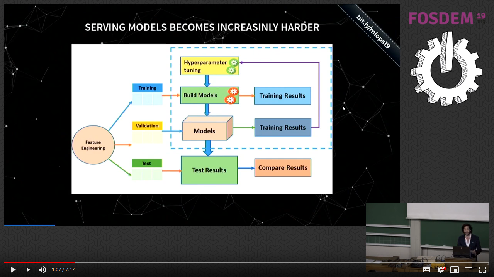

# Awesome production machine learning

This repository contains a curated list of awesome open source libraries that will help you deploy, monitor, version, scale, and secure your production machine learning.

## Quick links to sections in this page

| | | |
|-|-|-|
|[🔍 Explaining predictions & models](#explaining-black-box-models-and-datasets) |[🔏 Privacy preserving ML](#privacy-preserving-machine-learning) | [📜 Model & data versioning](#model-and-data-versioning)|
|[🏁 Model Orchestration](#model-deployment-and-orchestration-frameworks)|[⚔ Adversarial Robustness](#adversarial-robustness-libraries)|[🤖 Neural Architecture Search](#neural-architecture-search)|
| [📓 Reproducible Notebooks](#data-science-notebook-frameworks) | [📊 Visualisation frameworks](#industrial-strength-visualisation-libraries) | [🔠 Industry-strength NLP](#industrial-strength-nlp) |
| [🧵 Data pipelines & ETL](#data-pipeline-etl-frameworks) | [🏷️ Data Labelling](#data-labelling-tools-and-frameworks) |[🗞️ Data storage](#data-storage-optimisation) |
| [📡 Functions as a service](#function-as-a-service-frameworks)| [🗺️ Computation distribution](#computation-load-distribution-frameworks) | [📥 Model serialisation](#model-serialisation-formats) |
| [ Compiler optimisation](#compiler-optimisation-frameworks)| [💸 Data Stream Processing](#data-streaming-processing) | [🌀 Feature engineering](#feature-engineering-automation)
| [🎁 Feature Stores](#feature-stores) | [💰 Commercial Platforms](#commercial-platforms)

## 10 Min Video Overview

<table>
  <tr>
    <td width="30%">
        This <a href="https://www.youtube.com/watch?v=Ynb6X0KZKxY">10 minute video</a> provides an overview of the motivations for machine learning operations as well as a high level overview on some of the tools in this repo.
    </td>
    <td width="70%">
        
    </td>
  </tr>
</table>

## Want to receive recurrent updates on this repo and other advancements?

<table>
  <tr>
    <td width="30%">
         You can join the <a href="https://ethical.institute/mle.html">Machine Learning Engineer</a> newsletter. You will receive updates on open source frameworks, tutorials and articles curated by machine learning professionals.
    </td>
    <td width="70%">
        
    </td>
  </tr>
  <tr>
    <td width="30%">
         Also check out the <a href="https://github.com/EthicalML/awesome-artificial-intelligence-guidelines/">Awesome Artificial Intelligence Guidelines</a> List, where we aim to map the landscape of "Frameworks", "Codes of Ethics", "Guidelines", "Regulations", etc related to Artificial Intelligence.
    </td>
    <td width="70%">
        
    </td>
  </tr>
</table>

# Main Content

## Explaining Black Box Models and Datasets

* [XAI - eXplainableAI](https://github.com/EthicalML/xai)  - An eXplainability toolbox for machine learning.
* [Alibi](https://github.com/SeldonIO/alibi)  - Alibi is an open source Python library aimed at machine learning model inspection and interpretation. The initial focus on the library is on black-box, instance based model explanations.
* [SHAP](https://github.com/slundberg/shap)  - SHapley Additive exPlanations is a unified approach to explain the output of any machine learning model.
* [DeepLIFT](https://github.com/kundajelab/deeplift)  - Codebase that contains the methods in the paper ["Learning important features through propagating activation differences"](https://arxiv.org/abs/1704.02685). Here is the [slides](https://docs.google.com/file/d/0B15F_QN41VQXSXRFMzgtS01UOU0/edit?filetype=mspresentation) and the [video](https://vimeo.com/238275076) of the 15 minute talk given at ICML.
* [TreeInterpreter](https://github.com/andosa/treeinterpreter)  - Package for interpreting scikit-learn's decision tree and random forest predictions. Allows decomposing each prediction into bias and feature contribution components as described in http://blog.datadive.net/interpreting-random-forests/.
* [LIME](https://github.com/marcotcr/lime)  - Local Interpretable Model-agnostic Explanations for machine learning models.
* [ELI5](https://github.com/TeamHG-Memex/eli5)  - "Explain Like I'm 5" is a Python package which helps to debug machine learning classifiers and explain their predictions.
* [Skater](https://github.com/datascienceinc/Skater)  - Skater is a unified framework to enable Model Interpretation for all forms of model to help one build an Interpretable machine learning system often needed for real world use-cases
* [themis-ml](https://github.com/cosmicBboy/themis-ml)  - themis-ml is a Python library built on top of pandas and sklearn that implements fairness-aware machine learning algorithms.
* [IBM AI Fairness 360](https://github.com/IBM/AIF360)  - A comprehensive set of fairness metrics for datasets and machine learning models, explanations for these metrics, and algorithms to mitigate bias in datasets and models.
* [IBM AI Explainability 360](https://github.com/IBM/AIX360/)  - Interpretability and explainability of data and machine learning models including a comprehensive set of algorithms that cover different dimensions of explanations along with proxy explainability metrics.
* [casme](https://github.com/kondiz/casme)  - Example of using classifier-agnostic saliency map extraction on ImageNet presented on the paper ["Classifier-agnostic saliency map extraction"](https://arxiv.org/abs/1805.08249).
* [ContrastiveExplanation (Foil Trees)](https://github.com/MarcelRobeer/ContrastiveExplanation)  - Python script for model agnostic contrastive/counterfactual explanations for machine learning. Accompanying code for the paper ["Contrastive Explanations with Local Foil Trees"](https://arxiv.org/abs/1806.07470).
* [Microsoft InterpretML](https://github.com/Microsoft/interpret)  - InterpretML is an open-source package for training interpretable models and explaining blackbox systems.
* [DeepVis Toolbox](https://github.com/yosinski/deep-visualization-toolbox)  - This is the code required to run the Deep Visualization Toolbox, as well as to generate the neuron-by-neuron visualizations using regularized optimization. The toolbox and methods are described casually [here](http://yosinski.com/deepvis) and more formally in this [paper](https://arxiv.org/abs/1506.06579).
* [FairML](https://github.com/adebayoj/fairml)  - FairML is a python toolbox auditing the machine learning models for bias.
* [fairness](https://github.com/algofairness/fairness-comparison)  - This repository is meant to facilitate the benchmarking of fairness aware machine learning algorithms based on [this paper](https://arxiv.org/abs/1802.04422).
* [Integrated-Gradients](https://github.com/ankurtaly/Integrated-Gradients)  - This repository provides code for implementing integrated gradients for networks with image inputs.
* [iNNvestigate](https://github.com/albermax/innvestigate)  - An open-source library for analyzing Keras models visually by methods such as [DeepTaylor-Decomposition](https://www.sciencedirect.com/science/article/pii/S0031320316303582), [PatternNet](https://openreview.net/forum?id=Hkn7CBaTW), [Saliency Maps](https://arxiv.org/abs/1312.6034), and [Integrated Gradients](https://arxiv.org/abs/1703.01365).
* [LOFO Importance](https://github.com/aerdem4/lofo-importance)  - LOFO (Leave One Feature Out) Importance calculates the importances of a set of features based on a metric of choice, for a model of choice, by iteratively removing each feature from the set, and evaluating the performance of the model, with a validation scheme of choice, based on the chosen metric.
* [L2X](https://github.com/Jianbo-Lab/L2X)  - Code for replicating the experiments in the paper ["Learning to Explain: An Information-Theoretic Perspective on Model Interpretation"](https://arxiv.org/pdf/1802.07814.pdf) at ICML 2018
* [Aequitas](https://github.com/dssg/aequitas)  - An open-source bias audit toolkit for data scientists, machine learning researchers, and policymakers to audit machine learning models for discrimination and bias, and to make informed and equitable decisions around developing and deploying predictive risk-assessment tools.
* [pyBreakDown](https://github.com/MI2DataLab/pyBreakDown)  - A model agnostic tool for decomposition of predictions from black boxes. Break Down Table shows contributions of every variable to a final prediction.
* [rationale](https://github.com/taolei87/rcnn/tree/master/code/rationale)  - Code to implement learning rationales behind predictions with code for paper ["Rationalizing Neural Predictions"](https://github.com/taolei87/rcnn/tree/master/code/rationale)
* [Tensorflow's cleverhans](https://github.com/tensorflow/cleverhans)  - An adversarial example library for constructing attacks, building defenses, and benchmarking both. A python library to benchmark system's vulnerability to [adversarial examples](http://karpathy.github.io/2015/03/30/breaking-convnets/)
* [tensorflow's lucid](https://github.com/tensorflow/lucid)  - Lucid is a collection of infrastructure and tools for research in neural network interpretability.
* [tensorflow's Model Analysis](https://github.com/tensorflow/model-analysis)  - TensorFlow Model Analysis (TFMA) is a library for evaluating TensorFlow models. It allows users to evaluate their models on large amounts of data in a distributed manner, using the same metrics defined in their trainer.
* [Tensorboard's Tensorboard WhatIf](https://pair-code.github.io/what-if-tool/)  - Tensorboard screen to analyse the interactions between inference results and data inputs.
* [Themis](https://github.com/LASER-UMASS/Themis)  - Themis is a testing-based approach for measuring discrimination in a software system.
* [anchor](https://github.com/marcotcr/anchor)  - Code for the paper ["High precision model agnostic explanations"](https://homes.cs.washington.edu/~marcotcr/aaai18.pdf), a model-agnostic system that explains the behaviour of complex models with high-precision rules called anchors.
* [woe](https://github.com/boredbird/woe)  - Tools for WoE Transformation mostly used in ScoreCard Model for credit rating
* [responsibly](https://github.com/ResponsiblyAI/responsibly)  - Toolkit for auditing and mitigating bias and fairness of machine learning systems
* [captum](https://github.com/pytorch/captum)  - model interpretability and understanding library for PyTorch developed by Facebook. It contains general purpose implementations of integrated gradients, saliency maps, smoothgrad, vargrad and others for PyTorch models.

## Privacy Preserving Machine Learning
* [Intel Homomorphic Encryption Backend](https://github.com/NervanaSystems/he-transformer)  - The Intel HE transformer for nGraph is a Homomorphic Encryption (HE) backend to the Intel nGraph Compiler, Intel's graph compiler for Artificial Neural Networks.
* [PySyft](https://github.com/OpenMined/PySyft)  - A Python library for secure, private Deep Learning. PySyft decouples private data from model training, using Multi-Party Computation (MPC) within PyTorch.
* [Microsoft SEAL](https://github.com/microsoft/SEAL)  - Microsoft SEAL is an easy-to-use open-source (MIT licensed) homomorphic encryption library developed by the Cryptography Research group at Microsoft.
* [Google's Differential Privacy](https://github.com/google/differential-privacy)  - This is a C++ library of ε-differentially private algorithms, which can be used to produce aggregate statistics over numeric data sets containing private or sensitive information.
* [Tensorflow Privacy](https://github.com/tensorflow/privacy)  - A Python library that includes implementations of TensorFlow optimizers for training machine learning models with differential privacy.
* [TF-Encrypted](https://github.com/mortendahl/tf-encrypted)  - A Python library built on top of TensorFlow for researchers and practitioners to experiment with privacy-preserving machine learning.
* [Uber SQL Differencial Privacy](https://github.com/uber/sql-differential-privacy)  - Uber's open source framework that enforces differential privacy for general-purpose SQL queries.

## Model and Data Versioning
* [DAGsHub](https://dagshub.com) - The home for data science collaboration. A platform, based on DVC, for data science project management and collaboration.
* [Data Version Control (DVC)](https://github.com/iterative/dvc)  - A git fork that allows for version management of models
* [ModelDB](https://mitdbg.github.io/modeldb/)  - Framework to track all the steps in your ML code to keep track of what version of your model obtained which accuracy, and then visualise it and query it via the UI
* [Pachyderm](https://github.com/pachyderm/pachyderm)  - Open source distributed processing framework build on Kubernetes focused mainly on dynamic building of production machine learning pipelines - [(Video)](https://www.youtube.com/watch?v=LamKVhe2RSM)
* [steppy](https://github.com/neptune-ml/steppy)  - Lightweight, Python3 library for fast and reproducible machine learning experimentation. Introduces simple interface that enables clean machine learning pipeline design.
* [Quilt Data](https://github.com/quiltdata/quilt)  - Versioning, reproducibility and deployment of data and models.
* [Polyaxon](https://github.com/polyaxon/polyaxon)  - A platform for reproducible and scalable machine learning and deep learning on kubernetes. - [(Video)](https://www.youtube.com/watch?v=Iexwrka_hys)
* [ModelChimp](https://github.com/ModelChimp/modelchimp/)  - Framework to track and compare all the results and parameters from machine learning models [(Video)](https://vimeo.com/271246650)
* [PredictionIO](https://github.com/apache/predictionio)  - An open source Machine Learning Server built on top of a state-of-the-art open source stack for developers and data scientists to create predictive engines for any machine learning task
* [Apache Marvin](https://github.com/apache/incubator-marvin)  is a platform for model deployment and versioning that hides all complexity under the hood: data scientists just need to set up the server and write their code in an extended jupyter notebook.
* [MLflow](https://github.com/mlflow/mlflow)  - Open source platform to manage the ML lifecycle, including experimentation, reproducibility and deployment.
* [Sacred](https://github.com/IDSIA/sacred)  - Tool to help you configure, organize, log and reproduce machine learning experiments.
* [Catalyst](https://github.com/catalyst-team/catalyst)  - High-level utils for PyTorch DL & RL research. It was developed with a focus on reproducibility, fast experimentation and code/ideas reusing.
* [FGLab](https://github.com/Kaixhin/FGLab)  - Machine learning dashboard, designed to make prototyping experiments easier.
* [Studio.ML](https://github.com/studioml/studio)  - Model management framework which minimizes the overhead involved with scheduling, running, monitoring and managing artifacts of your machine learning experiments.
* [Flor](https://github.com/ucbrise/flor/blob/master/rtd/index.rst)  - Easy to use logger and automatic version controller made for data scientists who write ML code
* [D6tflow](https://github.com/d6t/d6tflow)  - A python library that allows for building complex data science workflows on Python.
* [TRAINS](https://github.com/allegroai/trains)  - Auto-Magical Experiment Manager & Version Control for AI.
* [Kedro](https://github.com/quantumblacklabs/kedro/)  - Kedro is a workflow development tool that helps you build data pipelines that are robust, scalable, deployable, reproducible and versioned.
* [MLWatcher](https://github.com/anodot/MLWatcher)  - MLWatcher is a python agent that records a large variety of time-serie metrics of your running ML classification algorithm. It enables you to monitor in real time.

## Model Deployment and Orchestration Frameworks
* [Cortex](https://github.com/cortexlabs/cortex)  - Cortex is an open source platform for deploying machine learning models—trained with nearly any framework—as production web services.
* [Seldon](https://github.com/SeldonIO/seldon-core)  - Open source platform for deploying and monitoring machine learning models in kubernetes - [(Video)](https://www.youtube.com/watch?v=pDlapGtecbY)
* [KFServing](https://github.com/kubeflow/kfserving)  - Serverless framework to deploy and monitor machine learning models in Kubernetes - [(Video)](https://www.youtube.com/watch?v=hGIvlFADMhU)
* [Redis-AI](https://github.com/RedisAI/RedisAI)  - A Redis module for serving tensors and executing deep learning models. Expect changes in the API and internals.
* [Model Server for Apache MXNet (MMS)](https://github.com/awslabs/mxnet-model-server)  - A model server for Apache MXNet from Amazon Web Services that is able to run MXNet models as well as Gluon models (Amazon's SageMaker runs a custom version of MMS under the hood)
* [Tensorflow Serving](https://www.tensorflow.org/serving/)  - High-performant framework to serve Tensorflow models via grpc protocol able to handle 100k requests per second per core
* [Clipper](https://github.com/ucbrise/clipper)  - Model server project from Berkeley's Rise Rise Lab which includes a standard RESTful API and supports TensorFlow, Scikit-learn and Caffe models
* [DeepDetect](https://github.com/beniz/deepdetect)  - Machine Learning production server for TensorFlow, XGBoost and Cafe models written in C++ and maintained by Jolibrain
* [MLeap](https://github.com/combust/mleap)  - Standardisation of pipeline and model serialization for Spark, Tensorflow and sklearn
* [OpenScoring](https://github.com/openscoring/openscoring)  - REST web service for scoring PMML models built and maintained by OpenScoring.io
* [Open Platform for AI](https://github.com/Microsoft/pai)  - Platform that provides complete AI model training and resource management capabilities.
* [NVIDIA TensorRT](https://github.com/NVIDIA/TensorRT) - TensorRT is a C++ library for high performance inference on NVIDIA GPUs and deep learning accelerators.
* [NVIDIA TensorRT Inference Server](https://github.com/NVIDIA/tensorrt-inference-server) - TensorRT Inference Server is an inference microservice that lets you serve deep learning models in production while maximizing GPU utilization.
* [Kubeflow](https://github.com/kubeflow/kubeflow)  - A cloud native platform for machine learning based on Google’s internal machine learning pipelines.
* [Ray](https://github.com/ray-project/ray)  - Ray is a flexible, high-performance distributed execution framework for machine learning ([VIDEO](https://www.youtube.com/watch?v=D_oz7E4v-U0))
* [Redis-ML](https://github.com/RedisLabsModules/redis-ml)  - Module available from unstable branch that supports a subset of ML models as Redis data types. (Replaced by Redis AI)
* [Hopsworks](https://github.com/logicalclocks/hopsworks)  - Hopsworks is a data-intensive platform for the design and operation of machine learning pipelines that includes a Feature Store. [(Video)](https://www.youtube.com/watch?v=v1DrnY8caVU).
* [Skaffold](https://github.com/GoogleContainerTools/skaffold)  - Skaffold is a command line tool that facilitates continuous development for Kubernetes applications. You can iterate on your application source code locally then deploy to local or remote Kubernetes clusters.

## Adversarial Robustness Libraries
* [Alibi Detect](https://github.com/SeldonIO/alibi-detect)  - alibi-detect is a Python package focused on outlier, adversarial and concept drift detection. The package aims to cover both online and offline detectors for tabular data, text, images and time series. The outlier detection methods should allow the user to identify global, contextual and collective outliers.
* [CleverHans](https://github.com/tensorflow/cleverhans)  - library for testing adversarial attacks / defenses maintained by some of the most important names in adversarial ML, namely Ian Goodfellow (ex-Google Brain, now Apple) and Nicolas Papernot (Google Brain). Comes with some nice tutorials!
* [IBM Adversarial Robustness 360 Toolbox (ART)](https://github.com/IBM/adversarial-robustness-toolbox)  - at the time of writing this is the most complete off-the-shelf resource for testing adversarial attacks and defenses. It includes a library of 15 attacks, 10 empirical defenses, and some nice evaluation metrics. Neural networks only.
* [Foolbox](https://github.com/bethgelab/foolbox)  - second biggest adversarial library. Has an even longer list of attacks - but no defenses or evaluation metrics. Geared more towards computer vision. Code easier to understand / modify than ART - also better for exploring blackbox attacks on surrogate models.
* [AdvBox](https://github.com/advboxes/AdvBox)  - generate adversarial examples from the command line with 0 coding using PaddlePaddle, PyTorch, Caffe2, MxNet, Keras, and TensorFlow. Includes 10 attacks and also 6 defenses. Used to implement [StealthTshirt](https://github.com/advboxes/AdvBox/blob/master/applications/StealthTshirt/README.md) at DEFCON!
* [EvadeML](https://github.com/mzweilin/EvadeML-Zoo)  - benchmarking and visualization tool for adversarial ML maintained by Weilin Xu, a PhD at University of Virginia, working with David Evans. Has a tutorial on re-implementation of one of the most important adversarial defense papers - [feature squeezing](https://arxiv.org/abs/1704.01155) (same team).
* [Adversarial DNN Playground](https://github.com/QData/AdversarialDNN-Playground)  - think [TensorFlow Playground](https://playground.tensorflow.org/), but for Adversarial Examples! A visualization tool designed for learning and teaching - the attack library is limited in size, but it has a nice front-end to it with buttons you can press!
* [AdverTorch](https://github.com/BorealisAI/advertorch)  - library for adversarial attacks / defenses specifically for PyTorch.
* [TextFool](https://github.com/bogdan-kulynych/textfool)  - plausible looking adversarial examples for text generation.
* [Artificial Adversary](https://github.com/airbnb/artificial-adversary)  AirBnB's library to generate text that reads the same to a human but passes adversarial classifiers.
* [DEEPSEC](https://github.com/kleincup/DEEPSEC)  - another systematic tool for attacking and defending deep learning models.
* [MIA](https://github.com/spring-epfl/mia)  - A library for running membership inference attacks (MIA) against machine learning models.
* [Trickster](https://github.com/spring-epfl/trickster)  - Library and experiments for attacking machine learning in discrete domains using graph search.
* [Nicolas Carlini’s Adversarial ML reading list](https://nicholas.carlini.com/writing/2018/adversarial-machine-learning-reading-list.html) - not a library, but a curated list of the most important adversarial papers by one of the leading minds in Adversarial ML, Nicholas Carlini. If you want to discover the 10 papers that matter the most - I would start here.
* [Robust ML](https://www.robust-ml.org/defenses/) - another robustness resource maintained by some of the leading names in adversarial ML. They specifically focus on defenses, and ones that have published code available next to papers. Practical and useful.

## Neural Architecture Search
* [Neural Network Intelligence](https://github.com/Microsoft/nni)  - NNI (Neural Network Intelligence) is a toolkit to help users run automated machine learning (AutoML) experiments.
* [Autokeras](https://github.com/jhfjhfj1/autokeras)  - AutoML library for Keras based on ["Auto-Keras: Efficient Neural Architecture Search with Network Morphism"](https://arxiv.org/abs/1806.10282).
* [ENAS-PyTorch](https://github.com/carpedm20/ENAS-pytorch)  - Efficient Neural Architecture Search (ENAS) in PyTorch based [on this paper](https://arxiv.org/abs/1802.03268).
* [Neural Architecture Search with Controller RNN](https://github.com/titu1994/neural-architecture-search)  - Basic implementation of Controller RNN from [Neural Architecture Search with Reinforcement Learning](https://arxiv.org/abs/1611.01578) and [Learning Transferable Architectures for Scalable Image Recognition](https://arxiv.org/abs/1707.07012).
* [ENAS via Parameter Sharing](https://github.com/melodyguan/enas) - Efficient Neural Architecture Search via Parameter Sharing by [authors of paper](https://arxiv.org/abs/1802.03268).
* [ENAS-Tensorflow](https://github.com/MINGUKKANG/ENAS-Tensorflow)  - Efficient Neural Architecture search via parameter sharing(ENAS) micro search Tensorflow code for windows user.
* [Maggy](https://github.com/logicalclocks/maggy)  - Asynchronous, directed Hyperparameter search and parallel ablation studies on Apache Spark [(Video)](https://www.youtube.com/watch?v=0Hd1iYEL03w).

## Data Science Notebook Frameworks
* [ML Workspace](https://github.com/ml-tooling/ml-workspace)  - All-in-one web IDE for machine learning and data science. Combines Jupyter, VS Code, Tensorflow, and many other tools/libraries into one Docker image.
* [Polynote](https://github.com/ml-tooling/ml-workspace)  - Polynote is an experimental polyglot notebook environment. Currently, it supports Scala and Python (with or without Spark), SQL, and Vega.
* [Jupyter Notebooks](https://github.com/jupyter/notebook)  - Web interface python sandbox environments for reproducible development
* [Stencila](https://github.com/stencila/stencila)  - Stencila is a platform for creating, collaborating on, and sharing data driven content. Content that is transparent and reproducible.
* [RMarkdown](https://github.com/rstudio/rmarkdown)  - The rmarkdown package is a next generation implementation of R Markdown based on Pandoc.
* [Hydrogen](https://atom.io/packages/hydrogen) - A plugin for ATOM that enables it to become a jupyter-notebook-like interface that prints the outputs directly in the editor.
* [H2O Flow](https://www.h2o.ai/download/) - Jupyter notebook-like interface for H2O to create, save and re-use "flows"

## Industrial Strength Visualisation libraries
* [Plotly Dash](https://github.com/plotly/dash)  - Dash is a Python framework for building analytical web applications without the need to write javascript.
* [Streamlit](https://github.com/streamlit/streamlit)  - Streamlit lets you create apps for your machine learning projects with deceptively simple Python scripts. It supports hot-reloading, so your app updates live as you edit and save your file
* [PDPBox](https://github.com/SauceCat/PDPbox)  - This repository is inspired by ICEbox. The goal is to visualize the impact of certain features towards model prediction for any supervised learning algorithm. (now support all scikit-learn algorithms)
* [PyCEbox](https://github.com/AustinRochford/PyCEbox)  - Python Individual Conditional Expectation Plot Toolbox
* [Plotly.py](https://github.com/plotly/plotly.py)  - An interactive, open source, and browser-based graphing library for Python.
* [Pixiedust](https://github.com/pixiedust/pixiedust)  - PixieDust is a productivity tool for Python or Scala notebooks, which lets a developer encapsulate business logic into something easy for your customers to consume.
* [ggplot2](https://github.com/tidyverse/ggplot2)  - An implementation of the grammar of graphics for R.
* [seaborn](https://github.com/mwaskom/seaborn)  - Seaborn is a Python visualization library based on matplotlib. It provides a high-level interface for drawing attractive statistical graphics.
* [Bokeh](https://github.com/bokeh/bokeh)  - Bokeh is an interactive visualization library for Python that enables beautiful and meaningful visual presentation of data in modern web browsers.
* [matplotlib](https://github.com/matplotlib/matplotlib)  - A Python 2D plotting library which produces publication-quality figures in a variety of hardcopy formats and interactive environments across platforms.
* [pygal](https://github.com/Kozea/pygal)  - pygal is a dynamic SVG charting library written in python
* [Geoplotlib](https://github.com/andrea-cuttone/geoplotlib)  - geoplotlib is a python toolbox for visualizing geographical data and making maps
* [Missigno](https://github.com/ResidentMario/missingno)  - missingno provides a small toolset of flexible and easy-to-use missing data visualizations and utilities that allows you to get a quick visual summary of the completeness (or lack thereof) of your dataset.
* [XKCD-style plots](http://jakevdp.github.io/blog/2013/07/10/XKCD-plots-in-matplotlib/) - An XKCD theme for matblotlib visualisations
* [yellowbrick](https://github.com/DistrictDataLabs/yellowbrick)  - yellowbrick is a matplotlib-based model evaluation plots for scikit-learn and other machine learning libraries.

## Industrial Strength NLP
* [SpaCy](https://github.com/explosion/spaCy)  - Industrial-strength natural language processing library built with python and cython by the explosion.ai team.
* [sense2vec](https://github.com/explosion/sense2vec)  - A Pytorch library that allows for training and using sense2vec models, which are models that leverage the same approach than word2vec, but also leverage part-of-speech attributes for each token, which allows it to be "meaning-aware"
* [Flair](https://github.com/zalandoresearch/flair)  - Simple framework for state-of-the-art NLP developed by Zalando which builds directly on PyTorch.
* [CTRL](https://github.com/salesforce/ctrl)  - A Conditional Transformer Language Model for Controllable Generation released by SalesForce
* [Wav2Letter++](https://code.fb.com/ai-research/wav2letter/) - A speech to text system developed by Facebook's FAIR teams.
* [GNES](https://github.com/gnes-ai/gnes)  - Generic Neural Elastic Search is a cloud-native semantic search system based on deep neural networks.
* [GluonNLP](https://github.com/dmlc/gluon-nlp)  - GluonNLP is a toolkit that enables easy text preprocessing, datasets loading and neural models building to help you speed up your Natural Language Processing (NLP) research.
* [OpenAI GPT-2](https://github.com/openai/gpt-2)  - OpenAI's code from their paper ["Language Models are Unsupervised Multitask Learners"](https://d4mucfpksywv.cloudfront.net/better-language-models/language-models.pdf).
* [Facebook's XLM](https://github.com/facebookresearch/XLM)  - PyTorch original implementation of Cross-lingual Language Model Pretraining which includes BERT, XLM, NMT, XNLI, PKM, etc.
* [YouTokenToMe](https://github.com/vkcom/youtokentome)  - YouTokenToMe is an unsupervised text tokenizer focused on computational efficiency. It currently implements fast Byte Pair Encoding (BPE) [Sennrich et al.].
* [Blackstone](https://github.com/ICLRandD/Blackstone)  - Blackstone is a spaCy model and library for processing long-form, unstructured legal text. Blackstone is an experimental research project from the Incorporated Council of Law Reporting for England and Wales' research lab, ICLR&D.
* [Snorkel](https://github.com/snorkel-team/snorkel)  - Snorkel is a system for quickly generating training data with weak supervision https://snorkel.org.
* [Tensorflow Text](https://github.com/tensorflow/text)  - TensorFlow Text provides a collection of text related classes and ops ready to use with TensorFlow 2.0.
* [Pytorch Transformers](https://github.com/huggingface/pytorch-transformers)  - Huggingface's library of state-of-the-art pretrained models for Natural Language Processing (NLP).
* [Grover](https://github.com/rowanz/grover)  - Grover is a model for Neural Fake News -- both generation and detection. However, it probably can also be used for other generation tasks.
* [Kashgari](https://github.com/BrikerMan/Kashgari)  - Kashgari is a simple and powerful NLP Transfer learning framework, build a state-of-art model in 5 minutes for named entity recognition (NER), part-of-speech tagging (PoS), and text classification tasks.
* [Github's Semantic](https://github.com/github/semantic)  - Github's text library for parsing, analyzing, and comparing source code across many languages .
* [Stable Baselines](https://github.com/hill-a/stable-baselines)  - A fork of OpenAI Baselines, implementations of reinforcement learning algorithms http://stable-baselines.readthedocs.io/.

## Data Pipeline ETL Frameworks
* [Apache Airflow](https://airflow.apache.org/) - Data Pipeline framework built in Python, including scheduler, DAG definition and a UI for visualisation
* [Azkaban](https://azkaban.github.io/)  - Azkaban is a batch workflow job scheduler created at LinkedIn to run Hadoop jobs. Azkaban resolves the ordering through job dependencies and provides an easy to use web user interface to maintain and track your workflows.
* [Luigi](https://github.com/spotify/luigi)  - Luigi is a Python module that helps you build complex pipelines of batch jobs, handling dependency resolution, workflow management, visualisation, etc
* [Genie](https://github.com/Netflix/genie)  - Job orchestration engine to interface and trigger the execution of jobs from Hadoop-based systems
* [Oozie](http://oozie.apache.org/) - Workflow scheduler for Hadoop jobs
* [Apache Nifi](https://github.com/apache/nifi)  - Apache NiFi was made for dataflow. It supports highly configurable directed graphs of data routing, transformation, and system mediation logic.
* [Neuraxle](https://github.com/Neuraxio/Neuraxle)  - A framework for building neat pipelines, providing the right abstractions to chain your data transformation and prediction steps with data streaming, as well as doing hyperparameter searches (AutoML).

## Data Labelling Tools and Frameworks
* [Labelimg](https://github.com/tzutalin/labelImg)  - Open source graphical image annotation tool writen in Python using QT for graphical interface focusing primarily on bounding boxes.
* [Computer Vision Annotation Tool (CVAT)](https://github.com/opencv/cvat)  - OpenCV's web-based annotation tool for both VIDEOS and images for computer algorithms.
* [Visual Object Tagging Tool (VOTT)](https://github.com/Microsoft/VoTT)  - Microsoft's Open Source electron app for labelling videos and images for object detection models (with active learning functionality)
* [Label Studio](https://github.com/heartexlabs/label-studio)  - Multi-domain data labeling and annotation tool with standardized output format
* [Labelbox](https://github.com/Labelbox/Labelbox)  - Open source image labelling tool with support for semantic segmentation (brush & superpixels), bounding boxes and nested classifications.
* [Doccano](https://github.com/chakki-works/doccano)  - Open source text annotation tools for humans, providing functionality for sentiment analysis, named entity recognition, and machine translation.
* [ImgLab](https://github.com/NaturalIntelligence/imglab)  - Image annotation tool for bounding boxes with auto-suggestion and extensibility for plugins.
* [ImageTagger](https://github.com/bit-bots/imagetagger)  - Image labelling tool with support for collaboration, supporting bounding box, polygon, line, point labelling, label export, etc.
* [PixelAnnotationTool](https://github.com/abreheret/PixelAnnotationTool)  - Image annotation tool with ability to "colour" on the images to select labels for segmentation. Process is semi-automated with the [watershed marked algorithm of OpenCV](docs.opencv.org/3.1.0/d7/d1b/group__imgproc__misc.html#ga3267243e4d3f95165d55a618c65ac6e1)
* [OpenLabeling](https://github.com/Cartucho/OpenLabeling)  - Open source tool for labelling images with support for labels, edges, as well as image resizing and zooming in.
* [Semantic Segmentation Editor](https://github.com/Hitachi-Automotive-And-Industry-Lab/semantic-segmentation-editor)  - Hitachi's Open source tool for labelling camera and LIDAR data.
* [Superintendent](https://github.com/janfreyberg/superintendent)  - superintendent provides an ipywidget-based interactive labelling tool for your data. 

## Data Storage Optimisation
* [EdgeDB](https://edgedb.com/) - NoSQL interface for Postgres that allows for object interaction to data stored
* [BayesDB](http://probcomp.csail.mit.edu/software/bayesdb/) - Database that allows for built-in non-parametric Bayesian model discovery and queryingi for data on a database-like interface - [(Video)](https://www.youtube.com/watch?v=2ws84s6iD1o)
* [Apache Arrow](https://arrow.apache.org/) - In-memory columnar representation of data compatible with Pandas, Hadoop-based systems, etc
* [Apache Parquet](https://parquet.apache.org/) - On-disk columnar representation of data compatible with Pandas, Hadoop-based systems, etc
* [Apache Kafka](https://kafka.apache.org/) - Distributed streaming platform framework
* [ClickHouse](https://clickhouse.yandex/) - ClickHouse is an open source column oriented database management system supported by Yandex - [(Video)](https://www.youtube.com/watch?v=zbjub8BQPyE)
* [Alluxio](https://www.alluxio.org/docs/1.8/en/Overview.html) - A virtual distributed storage system that bridges the gab between computation frameworks and storage systems.
* [HopsFS](https://github.com/hopshadoop/hops)  - HDFS-compatible file system with scale-out strongly consistent metadata.

## Function as a Service Frameworks
* [OpenFaaS](https://github.com/openfaas/faas)  - Serverless functions framework with RESTful API on Kubernetes
* [Fission](https://github.com/fission/fission)  - (Early Alpha) Serverless functions as a service framework on Kubernetes
* [Hydrosphere ML Lambda](https://github.com/Hydrospheredata/hydro-serving)  - Open source model management cluster for deploying, serving and monitoring machine learning models and ad-hoc algorithms with a FaaS architecture
* [Hydrosphere Mist](https://github.com/Hydrospheredata/mist)  - Serverless proxy for Apache Spark clusters
* [Apache OpenWhisk](https://github.com/apache/incubator-openwhisk)  - Open source, distributed serverless platform that executes functions in response to events at any scale.
* [KNative Serving](https://github.com/knative/serving)  - Kubernetes based serverless microservices with "scale-to-zero" functionality.

## Computation load distribution frameworks
* [Hadoop Open Platform-as-a-service (HOPS)](https://www.hops.io/) - A multi-tenancy open source framework with RESTful API for data science on Hadoop which enables for Spark, Tensorflow/Keras, it is Python-first, and provides a lot of features
* [PyWren](http://pywren.io) - Answer the question of the "cloud button" for python function execution. It's a framework that abstracts AWS Lambda to enable data scientists to execute any Python function - [(Video)](https://www.youtube.com/watch?v=OskQytBBdJU)
* [NumPyWren](https://github.com/Vaishaal/numpywren)  - Scientific computing framework build on top of pywren to enable numpy-like distributed computations
* [BigDL](https://bigdl-project.github.io/) - Deep learning framework on top of Spark/Hadoop to distribute data and computations across a HDFS system
* [Horovod](https://github.com/uber/horovod)  - Uber's distributed training framework for TensorFlow, Keras, and PyTorch
* [Apache Spark MLlib](https://spark.apache.org/mllib/) - Apache Spark's scalable machine learning library in Java, Scala, Python and R
* [Dask](http://dask.pydata.org/en/latest/) - Distributed parallel processing framework for Pandas and NumPy computations - [(Video)](https://www.youtube.com/watch?v=RA_2qdipVng)

## Model serialisation formats
* [ONNX](https://github.com/onnx/onnx)  - Open Neural Network Exchange Format
* [Neural Network Exchange Format (NNEF)](https://www.khronos.org/nnef) - A standard format to store models across Torch, Caffe, TensorFlow, Theano, Chainer, Caffe2, PyTorch, and MXNet
* [PFA](http://dmg.org/pfa/index.html) - Created by the same organisation as PMML, the Predicted Format for Analytics is an emerging standard for statistical models and data transformation engines.
* [PMML](http://dmg.org/pmml/v4-3/GeneralStructure.html) - The Predictive Model Markup Language standard in XML - ([Video](https://www.youtube.com/watch?v=_5pZm2PZ8Q8))_
* [MMdnn](https://github.com/Microsoft/MMdnn)  - Cross-framework solution to convert, visualize and diagnose deep neural network models.
* [Java PMML API](https://github.com/jpmml) - Java libraries for consuming and producing PMML files containing models from different frameworks, including:
    * [sklearn2pmml](https://github.com/jpmml/jpmml-sklearn)
    * [pyspark2pmml](https://github.com/jpmml/pyspark2pmml)
    * [r2pmml](https://github.com/jpmml/r2pmml)
    * [sparklyr2pmml](https://github.com/jpmml/sparklyr2pmml)

## Compiler optimisation frameworks
* [Numba](https://github.com/numba/numba) - A compiler for Python array and numerical functions

## Data Stream Processing
* [Apache Flink](https://github.com/apache/flink)  - Open source stream processing framework with powerful stream and batch processing capabilities.
* [Faust](https://github.com/robinhood/faust)  - Streaming library built on top of Python's Asyncio library using the async kafka client inspired by the kafka streaming library.
* [Kafka Streams](https://kafka.apache.org/documentation/streams/)  - Kafka client library for buliding applications and microservices where the input and output are stored in kafka clusters
* [Spark Streaming](https://spark.apache.org/streaming/)  - Micro-batch processing for streams using the apache spark framework as a backend supporting stateful exactly-once semantics
* [Apache Samza](http://samza.apache.org/)  - Distributed stream processing framework. It uses Apache Kafka for messaging, and Apache Hadoop YARN to provide fault tolerance, processor isolation, security, and resource management.
* [Brooklin](https://github.com/linkedin/Brooklin/)  - Distributed stream processing framework. It uses Apache Kafka for messaging, and Apache Hadoop YARN to provide fault tolerance, processor isolation, security, and resource management.

## Feature Engineering Automation
* [auto-sklearn](https://automl.github.io/auto-sklearn/)  - Framework to automate algorithm and hyperparameter tuning for sklearn
* [TPOT](https://epistasislab.github.io/tpot/)  - Automation of sklearn pipeline creation (including feature selection, pre-processor, etc)
* [tsfresh](https://github.com/blue-yonder/tsfresh)  - Automatic extraction of relevant features from time series
* [Featuretools](https://www.featuretools.com/) - An open source framework for automated feature engineering
* [Colombus](http://i.stanford.edu/hazy/victor/columbus/) - A scalable framework to perform exploratory feature selection implemented in R
* [AutoML-GS](https://github.com/minimaxir/automl-gs)  - Automatic feature and model search with code generation in Python, on top of common data science libraries (tensorflow, sklearn, etc)
* [automl](https://github.com/ClimbsRocks/auto_ml)  - Automated feature engineering, feature/model selection, hyperparam. optimisation
* [Feature Engine](https://github.com/solegalli/feature_engine)  - Feature-engine is a Python library that contains several transformers to engineer features for use in machine learning models. 

## Feature Stores
* [Hopsworks Feature Store](https://github.com/logicalclocks/hopsworks)  - Offline/Online Feature Store for ML [(Video)](https://www.youtube.com/watch?v=N1BjPk1smdg).
* [Feature Store for Machine Learning (FEAST)](https://github.com/gojek/feast)   - Feast (Feature Store) is a tool for managing and serving machine learning features. Feast is the bridge between models and data.
* [Veri](https://github.com/bgokden/veri)  - Veri is a Feature Label Store. Feature Label store allows storing features as keys and labels as values. Querying values is only possible with knn using features. Veri also supports creating sub sample spaces of data by default.
* [Ivory](https://github.com/antony-a1/ivory)   - ivory defines a specification for how to store feature data and provides a set of tools for querying it. It does not provide any tooling for producing feature data in the first place. All ivory commands run as MapReduce jobs so it assumed that feature data is maintained on HDFS.

## Commercial Platforms
* [cnvrg.io](https://cnvrg.io) - An end-to-end platform to manage, build and automate machine learning
* [Comet.ml](http://comet.ml) - Machine learning experiment management. Free for open source and students [(Video)](https://www.youtube.com/watch?v=xaybRkapeNE)
* [Skytree 16.0](http://skytree.net) - End to end machine learning platform [(Video)](https://www.youtube.com/watch?v=XuCwpnU-F1k)
* [Algorithmia](https://algorithmia.com/) - Cloud platform to build, deploy and serve machine learning models [(Video)](https://www.youtube.com/watch?v=qcsrPY0koyY)
* [y-hat](https://www.yhat.com/) - Deployment, updating and monitoring of predictive models in multiple languages [(Video)](https://www.youtube.com/watch?v=YiEjaWwzS_w)
* [Amazon SageMaker](https://aws.amazon.com/sagemaker/) - End-to-end machine learning development and deployment interface where you are able to build notebooks that use EC2 instances as backend, and then can host models exposed on an API
* [Google Cloud Machine Learning Engine](https://cloud.google.com/ml-engine/) - Managed service that enables developers and data scientists to build and bring machine learning models to production.
* [Microsoft Azure Machine Learning service](https://azure.microsoft.com/en-us/services/machine-learning-service/) - Build, train, and deploy models from the cloud to the edge.
* [IBM Watson Machine Learning](https://www.ibm.com/cloud/machine-learning) - Create, train, and deploy self-learning models using an automated, collaborative workflow.
* [neptune.ml](https://neptune.ml) - community-friendly platform supporting data scientists in creating and sharing machine learning models. Neptune facilitates teamwork, infrastructure management, models comparison and reproducibility.
* [Datmo](https://datmo.com/) - Workflow tools for monitoring your deployed models to experiment and optimize models in production.
* [Valohai](https://valohai.com/) - Machine orchestration, version control and pipeline management for deep learning.
* [Dataiku](https://www.dataiku.com/) - Collaborative data science platform powering both self-service analytics and the operationalization of machine learning models in production.
* [MCenter](https://www.parallelm.com/product/) - MLOps platform automates the deployment, ongoing optimization, and governance of machine learning applications in production.
* [Skafos](https://metismachine.com/products/) - Skafos platform bridges the gap between data science, devops and engineering; continuous deployment, automation and monitoring.
* [SKIL](https://skymind.ai/platform) - Software distribution designed to help enterprise IT teams manage, deploy, and retrain machine learning models at scale.
* [MLJAR](https://mljar.com/) - Platform for rapid prototyping, developing and deploying machine learning models.
* [MissingLink](https://missinglink.ai/) - MissingLink helps data engineers streamline and automate the entire deep learning lifecycle.
* [DataRobot](https://www.datarobot.com/) - Automated machine learning platform which enables users to build and deploy machine learning models.
* [RiseML](https://riseml.com/) - Machine Learning Platform for Kubernetes: RiseML simplifies running machine learning experiments on bare metal and cloud GPU clusters of any size.
* [Datatron](https://datatron.com/) - Machine Learning Model Governance Platform for all your AI models in production for large Enterprises.
* [Logical Clocks Hopsworks](https://www.logicalclocks.com/) - Enterprise version of Hopsworks with a Feature Store and scale-out ML pipeline design and operation.
* [Talend Studio](https://www.talend.com/)

