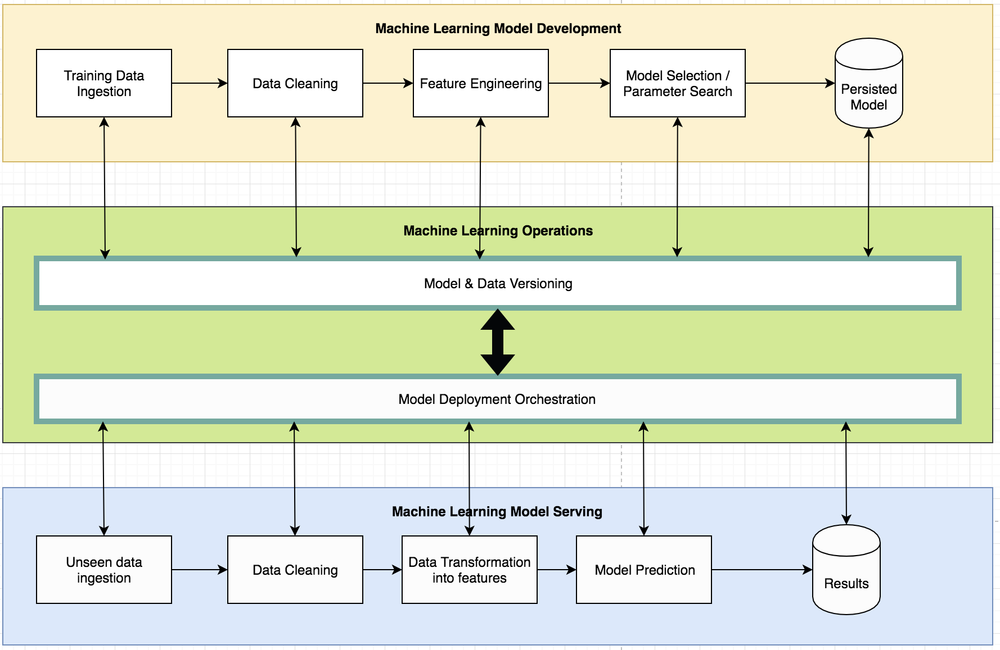

# Machine Learning Operations (ML + DevOps = MLOps)

## What is Machine Learning Operations (MLOps)?

Machine Learning Operations involves the infrastructure required to scale your ML capabilities. You can find an overview of MLOps in [Alejandro Saucedo's](https://twitter.com/AxSaucedo) talk at the 2018 EuroSciPy on [Scalable Data Science: The State of MLOps in 2018](https://axsauze.github.io/scalable-data-science/#/).

<table>
  <tr>
    <td width="30%">
        This repository covers two of the core principles of MLOps:
         
        <ul>
            <li><b>Reproducibility</b>: Model & Data Versioning</li>
            <li><b>Orchestration</b>: Model Deployment Orchestration</li>
        </ul>    
    </td>
    <td width="70%">
        
    </td>
  </tr>
</table>

## Overview of this repo

* This repository contains a curated list of awesome resources that will help you kick-start or enhance your machine learning operations
* Machine Learning Operations involve everything that is required to serve your ML, including deploying, monitoring, scaling, versioning, etc

# Main Contributors

* **Alejandro Saucedo** - Github: [AxSauze](https://github.com/axsauze/) - Twitter: [@AxSaucedo](https://twitter.com/AxSaucedo) - Linkedin: [/in/AxSaucedo](https://uk.linkedin.com/in/axsaucedo)

## Index

* Model standard formats
* Model versioning
* Data storage / standardisation
* Feature engineering automation
* Model deployment frameworks
* Computation load distribution frameworks
* Function as a service / Lambda frameworks
* Computational optimisation libraries
* Commercial data science platforms
* Commercial ETL platforms

## Main Contents

### Model Standard Formats for interoperability
* [ONNX](https://github.com/onnx/onnx) - Open Neural Network Exchange Format
* [Neural Network Exchange Format (NNEF)](https://www.khronos.org/nnef) - A standard format to store models across Torch, Caffe, TensorFlow, Theano, Chainer, Caffe2, PyTorch, and MXNet
* [PFA](http://dmg.org/pfa/index.html) - Created by the same organisation as PMML, the Predicted Format for Analytics is an emerging standard for statistical models and data transformation engines.
* [PMLL](http://dmg.org/pmml/v4-3/GeneralStructure.html) - The Predictive Model Markup Language standard in XML - ([Video](https://www.youtube.com/watch?v=_5pZm2PZ8Q8))_
* [Java PMML API](https://github.com/jpmml) - Java libraries for consuming and producing PMML files containing models from different frameworks, including:
    * [sklearn2pmml](https://github.com/jpmml/jpmml-sklearn)
    * [pyspark2pmml](https://github.com/jpmml/pyspark2pmml)
    * [r2pmml](https://github.com/jpmml/r2pmml)
    * [sparklyr2pmml](https://github.com/jpmml/sparklyr2pmml)

### Model & Pipeline Versioning
* [Data Version Control (DVC)](https://dvc.org/) - A git fork that allows for version management of models
* [ModelDB](https://mitdbg.github.io/modeldb/) - Framework to track all the steps in your ML code to keep track of what version of your model obtained which accuracy, and then visualise it and query it via the UI
* [Pachyderm](https://github.com/pachyderm/pachyderm) - Open source distributed processing framework build on Kubernetes focused mainly on dynamic building of production machine learning pipelines - [(Video)](https://www.youtube.com/watch?v=LamKVhe2RSM&t=1167s)
* [steppy](https://github.com/neptune-ml/steppy) - Lightweight, Python3 library for fast and reproducible machine learning experimentation. Introduces simple interface that enables clean machine learning pipeline design.
* [Jupyter Notebooks](http://jupyter.org/) - Web interface python sandbox environments for reproducible development
* [Quilt Data](https://quiltdata.com/) - Versioning, reproducibility and deployment of data and models.
* [H2O Flow](https://www.h2o.ai/download/) - Jupyter notebook-like inteface for H2O to create, save and re-use "flows"

### Data Storage / Standardisation / Privacy
* [EdgeDB](https://edgedb.com/) - NoSQL interface for Postgres that allows for object interaction to data stored
* [BayesDB](http://probcomp.csail.mit.edu/bayesdb/) - Database that allows for built-in non-parametric Bayesian model discovery and queryingi for data on a database-like interface - [(Video)](https://www.youtube.com/watch?v=2ws84s6iD1o)
* [Apache Arrow](https://arrow.apache.org/) - In-memory columnar representation of data compatible with Pandas, Hadoop-based systems, etc
* [Apache Parquet](https://parquet.apache.org/) - On-disk columnar representation of data compatible with Pandas, Hadoop-based systems, etc
* [Apache Kafka](https://kafka.apache.org/) - Distributed streaming platform framework
* [Uber SQL Differencial Privacy](https://github.com/uber/sql-differential-privacy) - Uber's open source framework that enforces differential privacy for general-purpose SQL queries.
* [ClickHouse](https://clickhouse.yandex/) - ClickHouse is an open source column oriented database management system supported by Yandex - [(Video)](https://www.youtube.com/watch?v=zbjub8BQPyE)

### Feature Engineering Automation
* [auto-sklearn](https://automl.github.io/auto-sklearn/stable/) - Framework to automate algorithm and hyperparameter tuning for sklearn
* [TPOT](https://epistasislab.github.io/tpot/) - Automation of sklearn pipeline creation (including feature selection, pre-processor, etc)
* [tsfresh](https://github.com/blue-yonder/tsfresh) - Automatic extraction of relevant features from time series
* [Featuretools](https://www.featuretools.com/) - An open source framework for automated feature engineering
* [Colombus](http://i.stanford.edu/hazy/victor/columbus/) - A scalable framework to perform exploratory feature selection implemented in R
* [automl](https://github.com/ClimbsRocks/automl) - Automated feature engineering, feature/model selection, hyperparam. optimisation

### Model Deployment Frameworks
* [Seldon](https://github.com/SeldonIO/seldon-core) - Open source platform for deploying and monitoring machine learning models in kubernetes - [(Video)](https://www.youtube.com/watch?v=pDlapGtecbY)
* [Redis-ML](https://github.com/RedisLabsModules/redis-ml) - Module available from unstable branch that supports a subset of ML models as Redis data types
* [Model Server for Apache MXNet (MMS)](https://github.com/awslabs/mxnet-model-server) - A model server for Apache MXNet from Amazon Web Services that is able to run MXNet models as well as Gluon models (Amazon's SageMaker runs a custom version of MMS under the hood)
* [Tensorflow Serving](https://www.tensorflow.org/serving/) - High-performant framework to serve Tensofrlow models via grpc protocol able to handle 100k requests per second per core
* [Clipper](http://clipper.ai/) - Model server project from Berkeley's Rise Rise Lab which includes a standard RESTful API and supports TensorFlow, Scikit-learn and Caffe models
* [DeepDetect](https://github.com/beniz/deepdetect) - Machine Learning production server for TensorFlow, XGBoost and Cafe models written in C++ and maintained by Jolibrain
* [MLeap](https://github.com/combust/mleap) - Standardisation of pipeline and model serialization for Spark, Tensorflow and sklearn
* [NVIDIA TensorRT](https://docs.nvidia.com/deeplearning/sdk/tensorrt-developer-guide/index.html) - Model server created by NVIDIA that runs models in ONNX format, including frameworks such as TensorFlow and MATLAB
* [OpenScoring](https://github.com/openscoring/openscoring) - REST web service for scoring PMML models built and maintained by OpenScoring.io

### Computation load distribution frameworks
* [Hadoop Open Platform-as-a-service (HOPS)](https://www.hops.io/) - A multi-tenency open source framework with RESTful API for data science on Hadoop which enables for Spark, Tensorflow/Keras, it is Python-first, and provides a lot of features
* [PyWren](http://pywren.io) - Answer the question of the "cloud button" for python function execution. It's a framework that abstracts AWS Lambda to enable data scientists to execute any Pyhton function - [(Video)](https://www.youtube.com/watch?v=OskQytBBdJU)
* [NumPyWren](https://github.com/Vaishaal/numpywren) - Scientific computing framework build on top of pywren to enable numpy-like distributed computations
* [BigDL - Deep learning framework on top of Spark/Hadoop to distribute data and computations across a HDFS system](https://bigdl-project.github.io/)
* [Horovod](https://github.com/uber/horovod) - Uber's distributed training framework for TensorFlow, Keras, and PyTorch
* [Apache Spark MLib](https://spark.apache.org/mllib/) - Apache Spark's scalable machine learning library in Java, Scala, Python and R
* [Dask](http://dask.pydata.org/en/latest/) - Distributed parallel processing framework for Pandas and NumPy computations - [(Video)](https://www.youtube.com/watch?v=RA_2qdipVng)

### Data Pipeline Frameworks
* [Apache Airflow](https://airflow.apache.org/) - Data Pipeline framework built in Python, including scheduler, DAG definition and a UI for visualisation
* [Luigi](https://github.com/spotify/luigi) - Luigi is a Python module that helps you build complex pipelines of batch jobs, handling dependency resolution, workflow management, visualisation, etc
* [Genie](https://github.com/Netflix/genie) - Job orchestration engine to interface and trigger the execution of jobs from Hadoop-based systems
* [Oozie](http://oozie.apache.org/) - Workflow scheduler for Hadoop jobs

### Function as a Service / Lambda Frameworks
* [OpenFaaS](https://github.com/openfaas/faas) - Serverless functions framework with RESTful API on Kubernetes
* [Fission](https://github.com/fission/fission) - (Early Alpha) Serverless functions as a service framework on Kubernetes
* [Hydrosphere ML Lambda](https://github.com/Hydrospheredata/hydro-serving) - Open source model management cluster for deploying, serving and monitoring machine learning models and ad-hoc algorithms with a FaaS architecture
* [Hydrosphere Mist](https://github.com/Hydrospheredata/mist) - Serverless proxy for Apache Spark clusters

### Infrastructure Orchestration Frameworks
* [Kubeflow](https://github.com/kubeflow/kubeflow) - A cloud native platform for machine learning based on Google’s internal machine learning pipelines.
* [Polyaxon](https://github.com/polyaxon/polyaxon) - A platform for reproducible and scalable machine learning and deep learning on kubernetes. - [(Video)](https://www.youtube.com/watch?v=Iexwrka_hys)

### Optimization of Computation
* [Numba](https://github.com/numba/numba) - A compiler for Python array and numerical functions

### Commercial Data-science Platforms
* [Comet.ml](http://comet.ml) - Machine learning experiment management. Free for open source and students [(Video)](https://www.youtube.com/watch?v=xaybRkapeNE)
* [Skytree 16.0](http://skytree.net) - End to end machine learning platform [(Video)](https://www.youtube.com/watch?v=XuCwpnU-F1k)
* [Algorithmia](https://algorithmia.com/) - Cloud platform to build, deploy and serve machine learning models [(Video)](https://www.youtube.com/watch?v=qcsrPY0koyY)
* [y-hat](https://www.yhat.com/) - Deployment, updating and monitoring of predictive models in multiple languages [(Video)](https://www.youtube.com/watch?v=YiEjaWwzS_w)
* [Amazon SageMaker](https://aws.amazon.com/sagemaker/) - End-to-end machine learning development and deployment interface where you are able to build notebooks that use EC2 instances as backend, and then can host models exposed on an API
* [neptune.ml](https://neptune.ml) - community-friendly platform supporting data scientists in creating and sharing machine learning models. Neptune facilitates teamwork, infrastructure management, models comparison and reproducibility.

### Commercial ETL Platforms
* [Talend Studio](https://www.talend.com/)
